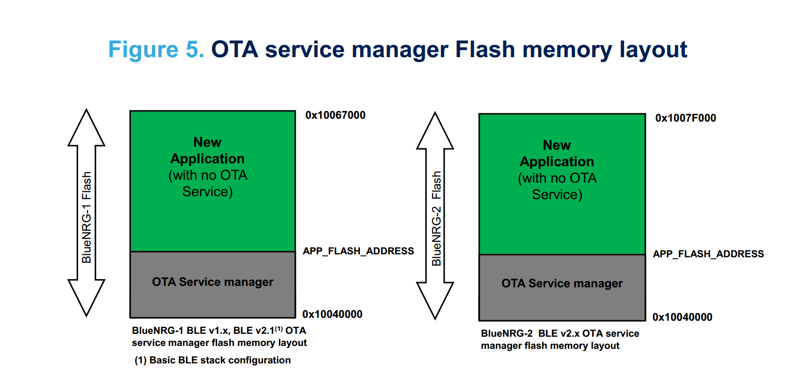
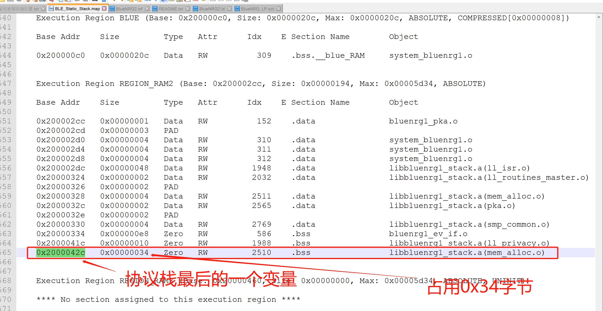
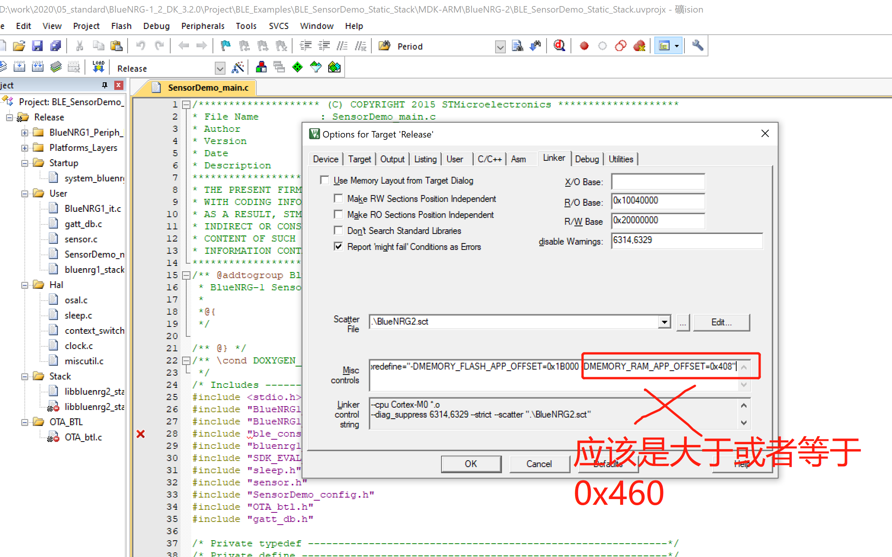
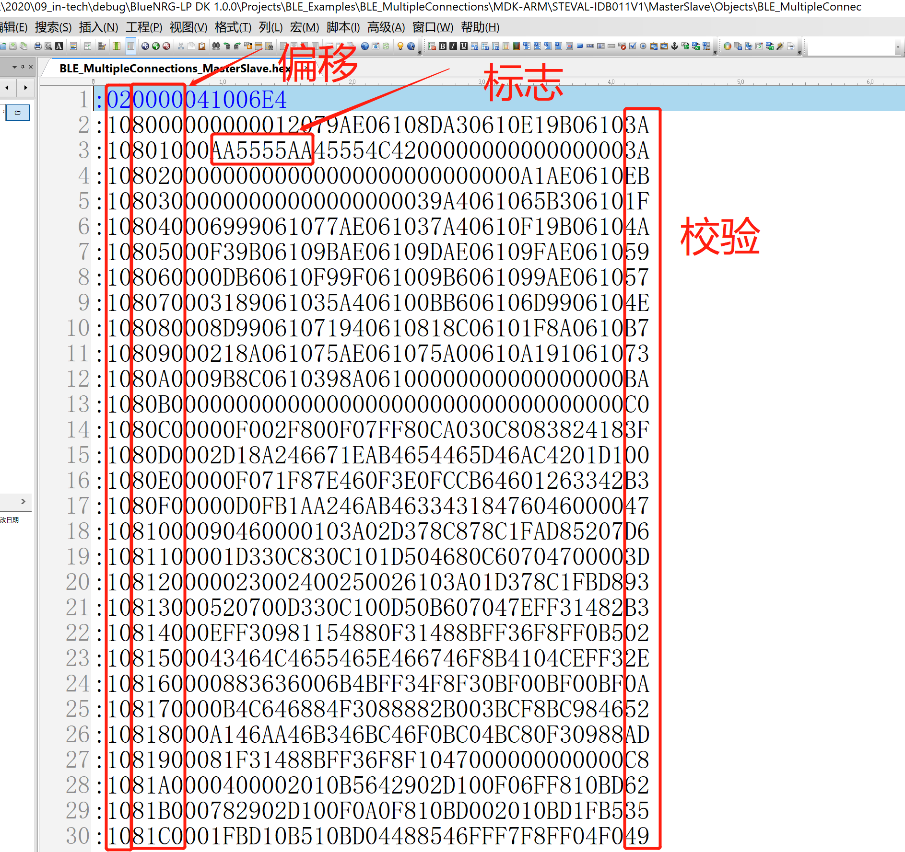

# BlueNRG系列存储分析（Flash and RAM）

## 背景：

​	一些使用BlueNRG系列芯片的客户希望预留部分Flash出来给特定的应用存放应用数据或者存放自己特定的应用程序，而又不知道如何修改程序或者配置。错误的配置可能让程序无法运行起来，或者产生一些莫名其妙的错误。下面从各个方便介绍BlueNRG系列的存储相关的基本概念和应用，只有理解了BlueNRG系列Flash和RAM相关的分布和OTA的方式，更改代码或者配置才能得心应手。

***温馨提示: 请使用最新版本的SDK进行开发***

# linker中宏定义作用范围

​	linker中宏定义可以定义一些宏，直接作用于链接脚本文件，需要注意的是，linker中宏定义并不作用于.c文件或者.h文件，只作用于链接文件（*.icf 或者*.sct 或者 *.ld）。


# 官方默认提供的OTA的方式

​	官方默认提供了两类OTA的方式，加上由于本身协议栈又可以固定在固定的位置(static stack),组合起来可以有4种。

​	OTA的详细描述可以参考文档: [AN4869_ The BlueNRG-1, BlueNRG-2 BLE OTA (over-the-air) firmware upgrade.pdf](https://www.st.com/resource/en/application_note/dm00293821.pdf)

下面只介绍大致的类别。

## A. 升级服务存在于应用端  BLE_OTA_ResetManager +  Lower Application (with BLE OTA service) or BLE_OTA_ResetManager +  Higher Application (with BLE OTA service)


​	此方法reset manager 代码可以比较小，2KB，OTA服务存在于应用程序中，应用程序可以备份，两个应用程序都包含协议栈。如果使用静态协议栈，则对应的Flash分布如下图（下图片是基于BlueNRG-LP的，如果是BlueNRG-1/2, Flash空间大小会不一样，协议栈大小也不一样，但这里主要描述基本框架，请忽略实际标记的Flash大小）


## B. 升级服务存在于boot端， BLE_OTA_ServiceManager + application




​	这种方式BLE_OTA_ServiceManager和application中都包含协议栈，OTA升级服务存在于boot程序BLE_OTA_ServiceManager中。

如果使用使用静态协议栈，则Flash的分布是这样的:


​	这种方式协议栈固定在Flash的开始处，Boot中带OTA服务，应用可以使用的空间比较大，上述图片是基于BlueNRG-LP的，如果是BlueNRG-1/2, Flash空间大小会不一样，协议栈占比也不一样（这里侧重描述Flash分布框架，请忽略实际标记的Flash大小）。

# 链接脚本文件分析:

链接脚本文件对于不同的编译工具，是不一样的。

Keil --> *.sct

IAR --> *.icf

True studio --> *.ld

​	下面分析BlueNRG-1/2的最新SDK中IAR平台Chat工程目录下BlueNRG2.icf文件,其他平台一样，可以进行类比。

​	分析前，我先介绍一个特点，由于Flash的擦除必须是整页操作的，写Flash之前必须将对应的页擦除，所以Flash的划分需要2K对齐。就算只使用到0.9KB，也需要划分2KB区域。

## RAM 相关的分析

​	BlueNRG-1/2和BlueNRG-LP系列内存基地址都是0x2000 0000, RAM相关的宏设置比较简单，只有一个相关的宏定义MEMORY_RAM_APP_OFFSET，如果没有定义，则默认为0x00。如果使用静态协议栈方式（固定协议栈）则需要定义此宏，将协议栈使用的内存和应用程序使用的内存区分开来。

举个例子:

​	SDK默认工程 **BLE_Static_Stack + BLE_SensorDemo_Static_Stack** 就是将协议栈使用的内存放在内存的低地址区域，将应用程序使用的内存放在高地址，即 BLE_Static_Stack 不定义偏移，使用从0地址开始，**BLE_SensorDemo_Static_Stack** 工程定义MEMORY_RAM_APP_OFFSET=0xyyy  ,其中0xyyy  可以设定为**BLE_Static_Stack**中使用内存变量的最后一个变量所在的地址，再加上最后一个变量所占的字节数。不同的编译器（IAR， keil，studio）所编译的协议栈占用的内存其实是略微有点点差别。

  比方说在BlueNRG-1/2 SDK中 **BLE_Static_Stack**工程中Keil工具编译到的map文件如下图：




那么在**BLE_SensorDemo_Static_Stack**工程中应该设定MEMORY_RAM_APP_OFFSET为: >= 0x2000042C - 0x20000000 + 0x34 = 0x460




这里官方这个工程Keil版本是自动生成的，和IAR的一致，需要用户手工调整一下。

## Flash 相关的分析

### **公共的宏：**

**MEMORY_FLASH_APP_SIZE**: 定义限制程序使用Flash的大小，**这里不一定是只指应用程序Flash大小的限制**，里面的APP字符容易让用户误会为应用程序，举个例子，如果使用BLE_OTA_ServiceManager工程时，在linker中定义MEMORY_FLASH_APP_SIZE = 0x3000, 则表明BLE_OTA_ServiceManager的大小不能超过0x3000 字节 = 12*1024 字节. 这里BLE_OTA_ServiceManager虽然作为boot程序，但宏定义MEMORY_FLASH_APP_SIZE也是限制本身这个工程编译的程序空间大小不能超过这个范围。

普通不带OTA服务的工程默认大小是: Flash size(256KB or 160KB) - NVM size(4KB)    // 160KB是当使用BlueNRG-1时，256KB 是使用BlueNRG-2 or BlueNRG-LP

**MEMORY_FLASH_APP_OFFSET**: 定义程序编译链接地址的偏移，**这里也是不一定是只指应用程序的偏移**，同样其他boot工程和其他工程也是同样作为工程链接地址的偏移。

### **基本概念**：

hex文件带地址信息，bin文件不带地址信息。

BlueNRG系列MCU，程序地址在编译时是强绑定的，比方说编译的程序地址是从0x10050000,直接直接下载该程序的bin文件到0x10040000是无法运行起来的。

不同编译平台，对应的linker设置位置不同

Keil  ----->   Option for target 'xxxx' ---> Linker-----> Misc controls

IAR ----->  Options ---> Linker ---> Configuration file symbol definitaions

True studio ---> xxxx---> xxxxx  // 此处我暂时也没有找到对应的地方


### **A类OTA(升级服务存在于应用端)**Flash分布

```c++
 +-----------------------+ 0x10080000
 |                       |
 |  NVM(4K)              |
 +-----------------------+ 0x1007E800
 |                       |
 |  Higher app (124K)    |
 +-----------------------+ 0x1005F800
 |                       |
 |  Lower app (124K)     |
 +-----------------------| 0x10040800
 |  Reset Manager (2K)   |
 +-----------------------+ 0x10040000
 
 // 上述A类OTA（升级服务存在于应用端）Flash 布局
 // 如果没有定义RESET_MANAGER_SIZE 则默认为2K
 if( !isdefinedsymbol( RESET_MANAGER_SIZE) ) {
    define symbol RESET_MANAGER_SIZE       = 0x800;
 }
// 计算应用程序可用大小
 define symbol MEMORY_FLASH_APP_SIZE   = (((_MEMORY_FLASH_SIZE_ - RESET_MANAGER_SIZE - FLASH_NVM_DATASIZE)/2)/2048)*2048;
// 计算应用程序偏移
 define symbol MEMORY_FLASH_APP_OFFSET = RESET_MANAGER_SIZE;
 // or 
 /*
 define symbol MEMORY_FLASH_APP_OFFSET = RESET_MANAGER_SIZE + MEMORY_FLASH_APP_SIZE;
 */
```


**ST_OTA_HIGHER_APPLICATION**:  Flash高地址部分的应用（上图Higher app ），当使能这个宏，编译应用程序到Flash的高地址，此方式支持OTA备份。

**ST_OTA_LOWER_APPLICATION:**   Flash低地址部分的应用（上图 Lower app ），当使能这个宏，编译应用程序到Flash的低地址，此方式支持OTA备份。

**RESET_MANAGER_SIZE:**  影响MEMORY_FLASH_APP_SIZE 和MEMORY_FLASH_APP_OFFSET的数值。如果使用A类静态协议栈方式OTA，这个数值一般在应用程序的linker处重新定义（协议栈和这部分融合在一块了）。


### **B类OTA(升级服务存在于应用端)**Flash分布

```c++
+-----------------------+ 0x10080000
|                       |
|  NVM(4K)              |
+-----------------------+ 0x1007F000
|                       |
|  User app (182K)      |
+-----------------------+ 0x10051800
|  OTA Service          |
|  Manager (70K)        |
+-----------------------+ 0x10040000

// 上述B类OTA（升级服务存在于boot端）Flash 布局
if( !isdefinedsymbol( SERVICE_MANAGER_SIZE) ) {
 define symbol SERVICE_MANAGER_SIZE   = 0x11800; /* Including OTA firmware upgrade service manager application */
}
// 计算应用程序size
define symbol MEMORY_FLASH_APP_SIZE   = _MEMORY_FLASH_SIZE_ - SERVICE_MANAGER_SIZE - FLASH_NVM_DATASIZE;
// 计算应用程序偏移
define symbol MEMORY_FLASH_APP_OFFSET = SERVICE_MANAGER_SIZE;
  
```

**ST_USE_OTA_SERVICE_MANAGER_APPLICATION:** 如果定义了此宏，使用上述方式B（升级服务存在于boot端， BLE_OTA_ServiceManager + application）内存方式

**SERVICE_MANAGER_SIZE**:  影响MEMORY_FLASH_APP_SIZE 和MEMORY_FLASH_APP_OFFSET的数值。如果使用B类静态协议栈方式OTA，这个数值一般在应用程序端的linker处需重新定义。

**C类非OTA类程序**Flash分布

```c++
  +-----------------------+ 0x10080000
  |                       |
  |  NVM(4K)              |
  +-----------------------+ 0x1007F000
  |                       |
  |  User app (252K)      |
  +-----------------------+ 0x10040000
  
  // 如果没有定义MEMORY_FLASH_APP_OFFSET 则默认0偏移
  if( !isdefinedsymbol( MEMORY_FLASH_APP_OFFSET) ) {
    define symbol MEMORY_FLASH_APP_OFFSET = 0;
  }
  // 如果没有定义MEMORY_FLASH_APP_SIZE， 则默认Flash size -NVM区域可用
  if( !isdefinedsymbol( MEMORY_FLASH_APP_SIZE) ) {
    define symbol MEMORY_FLASH_APP_SIZE   = _MEMORY_FLASH_SIZE_ - FLASH_NVM_DATASIZE - MEMORY_FLASH_APP_OFFSET;
  }
  
  
```


​	对于BlueNRG SDK系列程序，没有定义宏ST_USE_OTA_SERVICE_MANAGER_APPLICATION,ST_OTA_HIGHER_APPLICATION或者ST_OTA_LOWER_APPLICATION的程序，其实都会归属于C类非OTA类程序。

​	**A B C 类Flash分布本质上只是计算MEMORY_FLASH_APP_OFFSET和MEMORY_FLASH_APP_SIZE的方式不同而已，如果应用需要，也可以改动这个链接脚本文件。**

### 调试技巧

​	有时工程设置不对，程序没有跑起来，用户不知道如何排查错误，可以通过查看hex文件的内容来检查程序是否设置正确。

用stm32 flash utility 可以直接打开查看hex文件内容。


用UE或者notepad++ 也可以以二进制形式打开，此方式需要对HEX格式比较了解。




### **小结:**

​	首先，你需要确定你应用程序采用哪种OTA方式，A类还是B类还是C类；然后，需要考虑的是是否使用静态协议栈，使用静态协议栈的方式能够比较大力的节省Flash空间。从而，就可以确定程序采用的是哪种Flash分布，确定Flash分布后，更改相关的配置后，编译生成hex文件，检查对应的地址是否是正确的运行地址。

