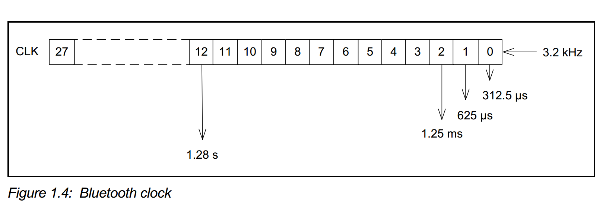
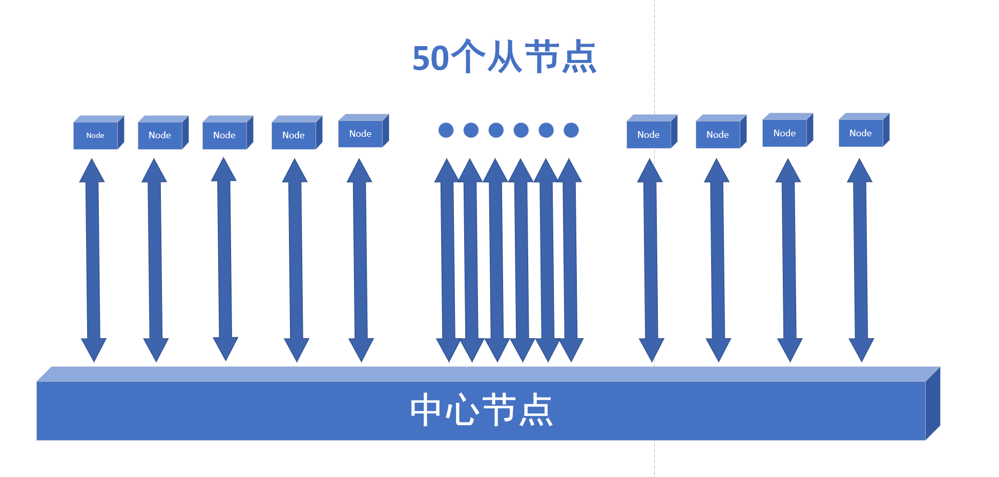
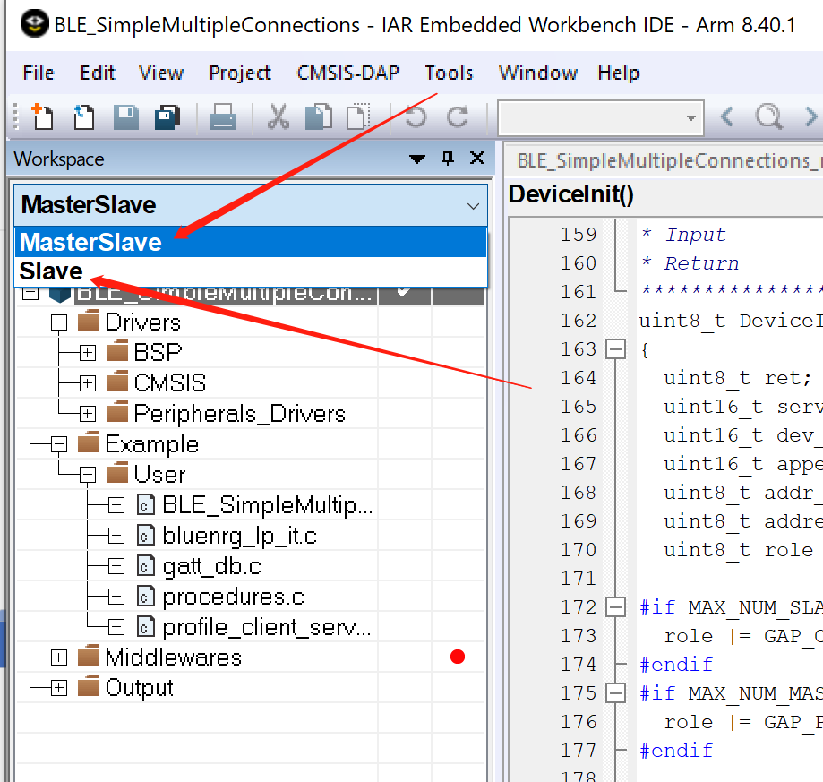
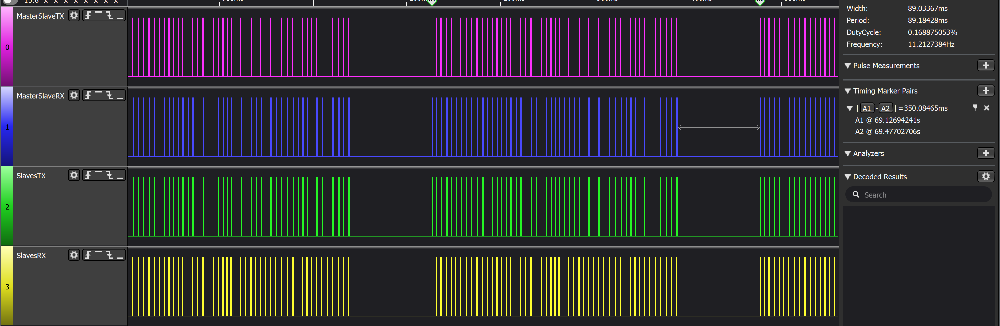

# 基于BLE多连接的星型网络应用 

​    ST的BLE芯片BlueNRG系列中的BlueNRG-1/2 或者是BlueNRG-LP系列（BlueNRG-3xx）都支持基于BLE 的多连接方案。

多连接的能力是衡量协议栈是否稳定强大的重要标准之一，下面我从多个方面探讨这块的应用，如果你有疑问，欢迎提出。

如果你还在疑惑该选用哪种网络组网方式，请阅读**《基于BLE芯片的多节点网络组网类型选型指南》**

## 应用范围

​    基于BLE 连接的星型网络可以应用于传感器网络，ESL货架标签系统， 冷链生鲜货物追踪系统，电表系统等等领域。不同的应用，对于通信速率，功耗，距离，可连接节点数，内存，Flash，外设等有着不一样的需求。而这些需求往往不是一个固定的值，往往很多时候，牺牲某些性能，能够提升另一些性能。这也是多连接复杂应用的体现。总的来说在以下范围内：

1. 单一的节点连接数量： 0~128 个。
2. 速率速率小于0.7倍物理PHY层： 1Mbps PHY 的话大致极限速率是700kbps, 2Mbps PHY 的极限速率大致在1400kbps, code PHY 类推。
3. 功耗： uA 级别到mA 级别（这里只算BLE芯片的平均功耗）。
4. 内存： 多连接的应用相对耗内存，节点数量越多，越耗内存。而剩余给应用的内存往往影响单一节点连接建立BLE 连接的数量

## 阅读须知

​	下文假设你有了基本的BLE 基础知识和概念（连接参数，广播，主机，从机，连接，断连,GATT，MTU等），如果你还没有相关的概念，建议先补充相关的基础知识。

## BlueNRG-x最多能连接几个  

​    这个问题是一个复杂的问题。首先，官方宣称走BLE是128个。但由于应用是复杂的，实际连接128个时，可能无法满足应用的其他需求（RAM ，通信速率等）。BLE 协议规范中并没有限制连接的个数，即无上限。但实际由于物理参数限制，能同时连接个数还是有限制的。  其次，BlueNRG-x 还可以走2.4G协议。  BlueNRG-LP 走2.4G协议理论上能做到更多的连接数量，和响应速度，但操作复杂度会更高一些。再之，BlueNRG-1/2 和BlueNRG-LP在这块上能力不同。  BlueNRG-1/2软件模拟多个链路层，而BlueNRG-LP是实际硬件上支持128个链路层。BlueNRG-1/2只能最多同时连接2个master，最多链路数量可以达到8，最多可以同时连接8个slave。  

对于BlueNRG-LP 最多能连接几个：

​	粗略计算： 最多能连接128个；应用数据不多，对响应速度不是特别高，应用内存需求不是特别高，可以比50节点更多一些；普通大数据，快响应24个节点以内，如果是同时连多个主机，能同时连接的数量肯定小于能同时连接从机的个数。  一个中心节点协调交互的时间片，比协调多个节点的交互的时间片更容易。

分析见后文。

## 参考资料

### BlueNRG-1/2 的多连接参考资料:

打开链接 [C:\Program Files (x86)\STMicroelectronics\BlueNRG-1_2 DK 3.2.1\Docs\index.html]()

官方SDK中本身提供了一个多连接的Demo, 路径如下:

C:\Users\user name\ST\BlueNRG-1_2 DK 3.2.1\Project\BLE_Examples\BLE_MS_Formula

本人测试到官方的SDK 连接很不稳定，所以改进了一个版本放在Github的如下链接上:

https://github.com/wallekuang/BlueNRG-1-2-Mul-Connecteion


### BlueNRG-LP 的多连接参考资料:

官方文档： 

《PM0269 Programming manual  Bluetooth LE stack v3.x programming guidelines  》的第4章节描述比较详细一些。

> > > 3.10 Simultaneously master, slave scenario  
> >
> > 4 Bluetooth LE stack v3.x scheduler  

50个节点连接参考Demo链接如下:

https://github.com/wallekuang/MultiConnectionForBlueNRG-LP


## BLE 多连接基本原理（分时复用）



所有链路层（LL）radio 任务（如 连接，广播，扫描）可以通过时隙序列在时基中表示（发生关联事件的时间窗口）。

Radio 任务的每个时隙都可以由以下表示：

一个时间的锚点：时间槽的确切开始时间；

一个长度：时间槽的预期持续时间；

**Radio 任务可以被归类为:**

1. **周期发生的**，其中时间槽应在固定时间间隔重复（例如，连接事件）
2. **异步的**， 

- 不会重复，一次性的的时间槽
- 时间槽预计会重复，但不是在固定的时间间隔（如，广播事件）


对于多连接，连接参数会有一定的限制，连接个数越多，限制越多，举个例子，只和一个设备连接，连接间隔可以取7.5ms，但是和20个设备同时连接，连接间隔设置为7.5ms,则会有问题。因为一个连接事件收发的时间加上与下一个设备连接事件之间的间隔也需要满足一定的条件。radio 每次收发切换也需要一定的时间。如果参数设置过于严苛，则很有可能让radio的状态发出错误，而导致协议栈报错：进入回调void hci_hardware_error_event(uint8_t Hardware_Code) ，Hardware_Code 为：0x01: Radio state error。如何知晓参数是否设置得过于严苛，或者还有多少预留，查看下一个章节。


## 星型网络Demo 使用说明

​    下面介绍在SDK 1.0.0的基础上优化的一个50个节点的工程。

​	源码放在了GitHub上:https://github.com/wallekuang/MultiConnectionForBlueNRG-LP

​    官方默认Demo路径 :

​	C:\Users\user name\ST\BlueNRG-LP DK 1.0.1ALPHA\Projects\BLE_Examples\BLE_MultipleConnections  

​	默认的Demo包含白名单配对等，比较复杂繁琐，而GitHub上的只包含透传，是简介版本。

### 网络拓扑结构如下图所示




### 实际验证测试

打开IAR工程可以看到工程中有两个Group，一个是中心节点的“MasterSlave”，一个是外围节点“Slave”(Keil 工程可以实际类比，这里就不一一叙述)。



50个节点，烧录还是实际硬件准备，都是比较难实现的。工程为了调试方便，默认是将Slave模拟成50个从节点，和同一个Master进行连接，即Slave和MaterSlave同时建立了50个链路的连接。如果你条件允许，有50个节点，实际测试验证时，可以将Slave中的Defined symbols 中宏定义**“MAX_NUM_MASTERS=50”更改为“MAX_NUM_MASTERS=1”**。

其实协议栈默认是不允许和同一个设备建立多个连接的，下面这个操作是允许和同一个设备建立多个连接的“暗门”。

```c
// 在初始化时调用  可以在aci_gap_init初始化之前调用
uint8_t val = 1;
aci_hal_write_config_data(0x30, 1, &val);
```

### 工程主要配置

#### 在工程Defined symbols中定义宏  

```c
// 最大链路数量
CONFIG_NUM_MAX_LINKS=50
// 角色 为中心节点或者其他
PROFILE_ROLE=ROLE_COLLECTOR
// 允许连接的主机数量
MAX_NUM_MASTERS=0
// 允许连接的从机数量
MAX_NUM_SLAVES=50 
```


#### 设置连接间隔广播间隔，ce-length等参数

不同的应用需求，有不一样的速率，功耗，响应速度，预留给应用的内存等不一样的需求。

```c
// 扫描事件和广播和连接事件冲突的话 ，优先级顺序为 扫描<广播<连接事件
#define SCAN_INTERVAL ((uint16_t)(100/0.625)) // 100 ms
#define SCAN_WINDOW ((uint16_t)(100/0.625)) // 100 ms
// 连接间隔
#define CONN_INTERVAL_MIN ((uint16_t)(350/1.25)) // 350 ms
#define CONN_INTERVAL_MAX ((uint16_t)(350/1.25)) // 350 ms
// 超时时间
#define SUPERVISION_TIMEOUT ((uint16_t)(2000/10)) // 2000 ms
#define CE_LENGTH ((uint16_t)(0/0.625)) // 0 ms
#define ADV_INTERVAL_MIN ((uint16_t)(350/0.625)) // 350 ms
#define ADV_INTERVAL_MAX ((uint16_t)(350/0.625)) // 350 ms
// BLE_SimpleMultipleConnections\Inc\MultipleConnections_config.h
#if PROFILE_ROLE == ROLE_COLLECTOR
#define NUM_LINKS                               (50)
#else
#define NUM_LINKS                               (50)
#endif
```

ce-length设置为0，则每个连接间隔只允许收发一次数据。 为了避免冲突，可以尽可能使参数处于同一周期，这样可能减少蓝牙事件的冲突。


### 测试与调试中心节点时间片的占用情况  

​    有时，出现断连或者对连接能力进行评估，需要对中心节点BLE的所有事件在时间轴上进行分析。
推荐使用GPIO加逻辑分析仪或者测试实时电流波形对TX与RX实时时序进行分析。使用使用GPIO加逻辑分析仪实时监视TXRX的方法见

文档**[《如何在Radio TX 或者RX时将某个GPIO置位高电平》]()**

下面添加好监视RadioTX RX 的状态查看一下收发的大致情况。




可以看到每个连接间隔有连续50条活跃TX和RX。每个不同设备之间TX必须要有一定的守卫时间，这里由于是连接50个节点，节点数量比较多，所以，Master-slave的TX与TX之间，调节到了一个相对比较小的值。当前默认的MTU应该是23个字节，留给应用每个连接间隔收发20个字节，如果应用需要更改的透传速率，则可以考虑把MTU加大或者切换为2M 的PHY。一般来说10ms是一个相对宽裕一些的数值，如果1个连接间隔MasterSlave与一个Slave只发送1包数据的话，数据包最大耗时大致是2128 µs左右。而每次守卫时间最小都是5ms以上，调节连接间隔也有一定程度利于增加速率。如果需要提高传输速率，建议首先调试的是MTU，在MTU调试到最大后还不够，可以考虑调节连接间隔和ce_length.

守卫时间实际不可调，由协议栈确定，而ce_length可以限制每个连接间隔，持续交互多长时间的数据包。如果数据包太密，有可能导致数据包在时间片上冲撞。太稀疏，则有可能达不到应用的性能需求，需要根据应用而确定。

每增加一个从节点数量，如果需要每个连接间隔都能让协议栈有足够的RAM 缓冲应用发送的消息，大致需要1KB的RAM。

## 实际应用场合  

1. 电表: 两主三从  
2. 小型传感器网络（中央空调，冷链系统）  
3. 运动器械（跳绳次数统计，足球训练统计）  
4. 各种BLE网关（ESL【超市价格标签】   
5. 智能家居。。。。。。


