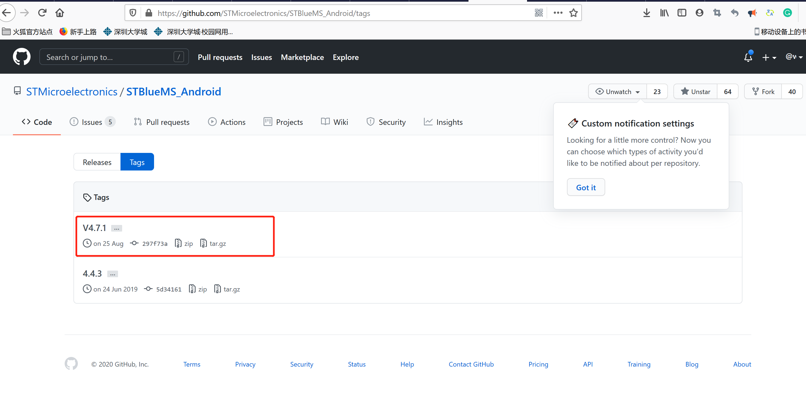
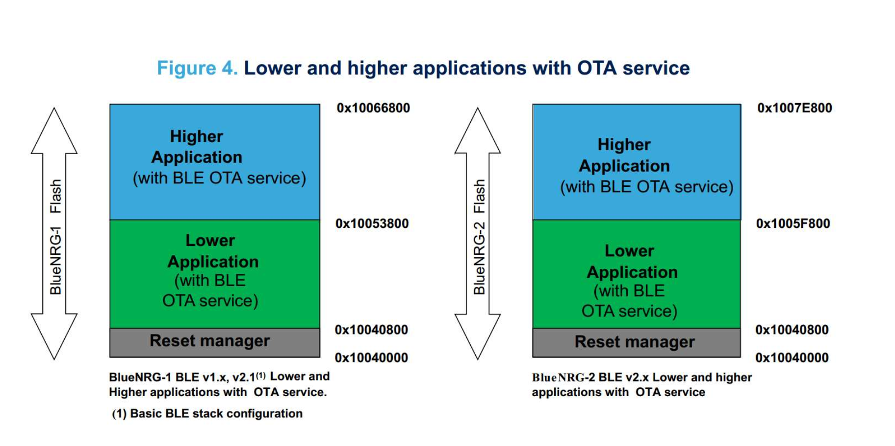
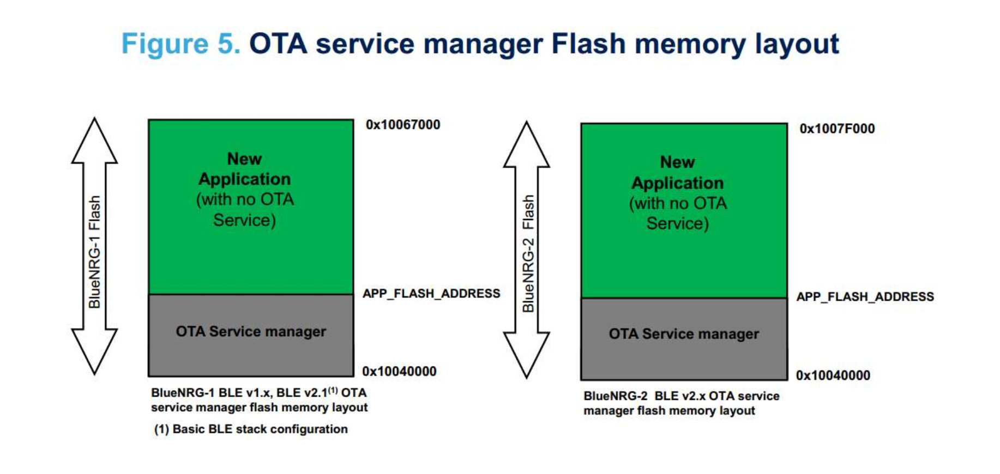
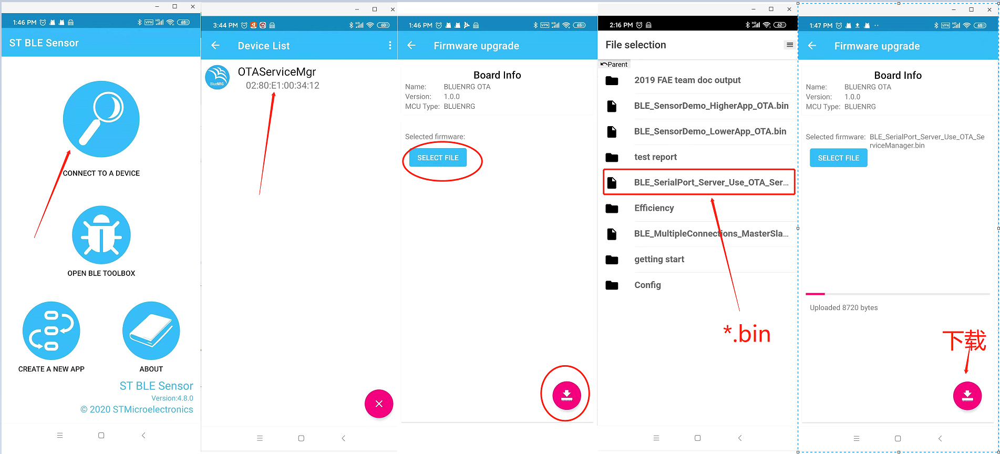
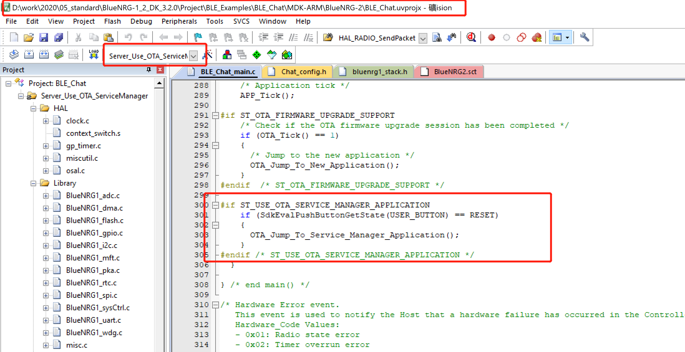

# FAQ_ BlueNRG-x系列官方OTA操作简介

​    这篇主要面向不熟悉ST BLE OTA方式的朋友，下面教程目的为了能让这部分朋友使用OTA可以快速的运行测试起来，可以顺利过渡到下一个阶段------->对自己应用程序添加OTA功能以及优化。

#### OTA 参考资料

##### BlueNRG-1/2/3 OTA 的 Android APP 的源码 :

https://github.com/STMicroelectronics/STBlueMS_Android  

##### IOS端源码:

https://github.com/STMicroelectronics/STBlueMS_iOS

##### 官方OTA文档：

[BLE Over Ther Air Firmware Upgrade (AN4869) ](https://www.st.com/resource/en/application_note/dm00293821.pdf)    (BlueNRG-1/2)

[AN5463 The BlueNRG-LP (over-the-air) firmware upgrade](https://www.st.com/resource/en/application_note/dm00691320-the-bluenrglp-ota-overtheair-firmware-upgrade-stmicroelectronics.pdf) (BlueNRG-3)

##### OTA 优化参考源码:

https://github.com/wallekuang/BlueNRG_Demo/tree/master/BlueNRG-1_2%20DK%203.1.0/Project/Supply/BLE_OtaDemo

由于目录中存在字模块，如果需要下载全部源码，记得加上--recursive选项

```shell
git clone --recurse-submodules https://github.com/STMicroelectronics/STBlueMS_Android 
```

​    如果只是需要下载apk，可以在源码的Tags目录中下载最新Release的版本。可以科学上网或者香港的朋友可以直接从Google play中下载。

<!--  -->


#### BlueNRG-1/2/3 的默认支持的升级方式  

##### Reset manager 加 lower or higher APP



##### OTA Service manager 加 APP

<!--  -->



#### OTA 升级操作图示（下面OTA Service manager 加 APP 为例子）

1. 下载OTA_ServiceManager固件到板子（官方开发板STEVAL-IDB011v1或者你自己的目标板都可以）上

**工程参考目录：BlueNRG-LP DK 1.0.0\Projects\BLE_Examples\BLE_OTA_ServiceManager**

2. 应用程序APP 默认我们使用的工程是

   **BlueNRG-LP DK 1.0.0\Projects\BLE_Examples\BLE_SerialPort---->Server_Use_OTA_ServiceManager**

   需要将这个工程编译好，将BIN文件放置在手机的某个目录中。

3. 安装好APP后(这里以Android 手机的ST BLE Sensor为例子，ST BlueDFU 也是可以进行升级，但由于这块的源码，笔者不熟，非Java语言，大多数国内的客户习惯使用Android studio进行开发，这里不演示ST BlueDF)

​	

<!--  -->



下载完后默认自动重启，就可以运行下载的应用程序了。如果是使用开发板，升级完后，按下PUSH1 则可以跳转到OTA升级程序中，运行升级程序。

<!--  -->



如果想更详细了解关于OTA的优化和分析  参考文档《FAQ_ 关于BlueNRG-1or2 OTA的流程与优化》《BlueNRG系列存储分析（Flash and RAM）》

