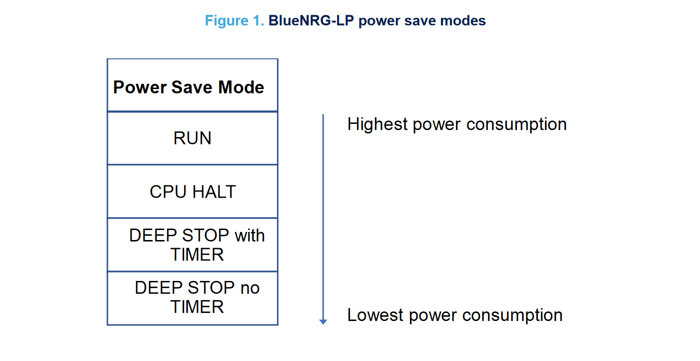
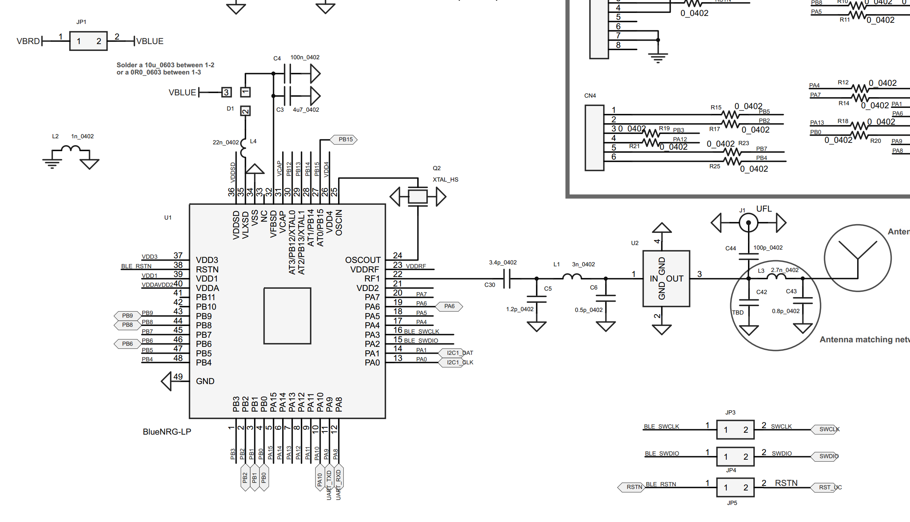
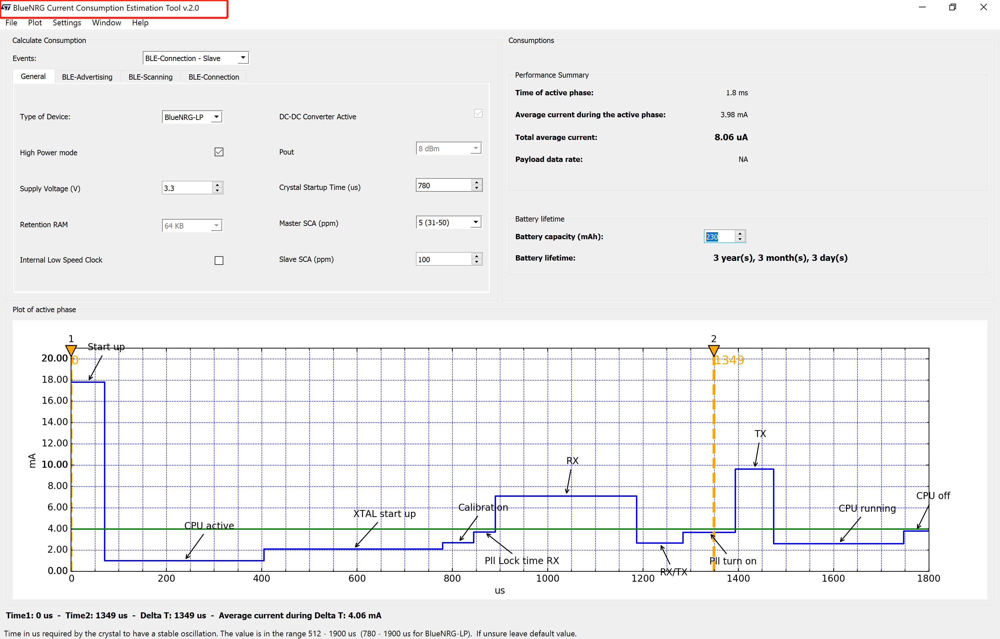
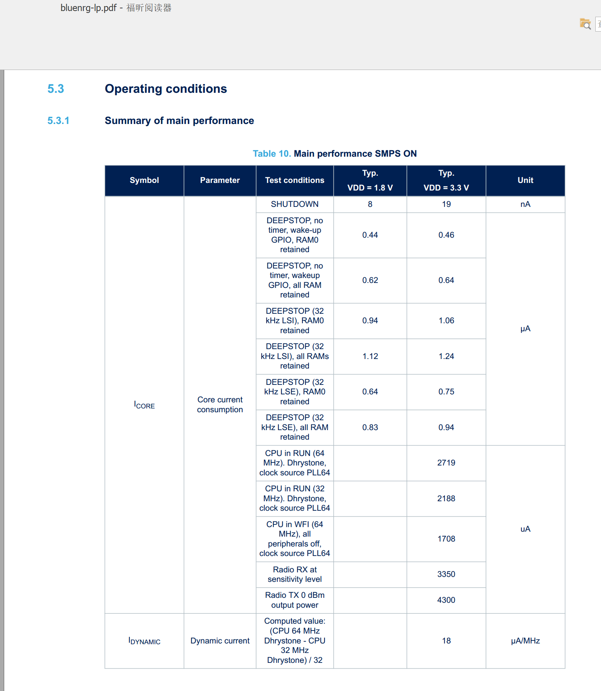
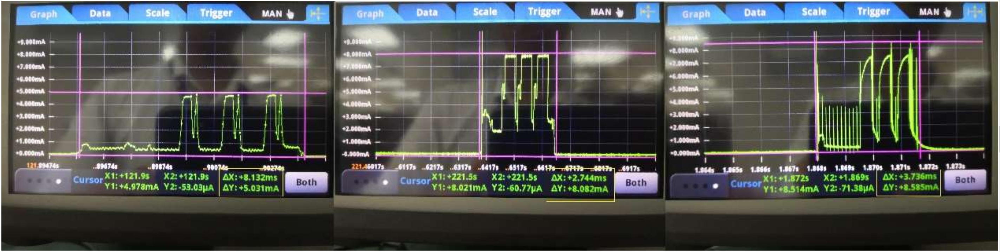

## 如何优化BlueNRG-x的功耗  

如何优化功耗，这是一个比较大的话题。这里简单说一下。

首先需要明白一个概念：这里说的睡眠都是瞬间状态的。举个例子，一个设备只需要1秒广播一次，假设每次广播只需要2.7ms，那么在每隔1秒中，只有那2.7ms的瞬间不是睡眠，其他瞬间都是可以处于睡眠状态。

## 官方参考资料

[BlueNRG-LP Power Save Modes Application Note (AN5466) ](https://www.st.com/resource/en/application_note/dm00691849-bluenrglp-power-save-modes--stmicroelectronics.pdf)

[BlueNRG-1,2 Low Power Modes Application Note (AN4820) ](https://www.st.com/resource/en/application_note/dm00263007.pdf)

## BlueNRG-LP的功耗模式

从软件层面的角度看，BlueNRG-LP的功耗模式有以下4种

```c
typedef enum {
  POWER_SAVE_LEVEL_RUNNING          = 0,	// 外设和CPU 全运行 ； 定时器，RTC，唤醒IO 可以唤醒
  POWER_SAVE_LEVEL_CPU_HALT         = 1,	// 外设运行，CPU 停止 ； 定时器，RTC，唤醒IO 可以唤醒
  POWER_SAVE_LEVEL_STOP_WITH_TIMER  = 2,	// 低速时钟32K产生的定时器运行，其他RTC 看门狗等可选是否运行； 定时器，【RTC】，唤醒IO 可以唤醒
  POWER_SAVE_LEVEL_STOP_NOTIMER     = 3，   // 低速32K产生的定时器不运行； 唤醒IO 可以唤醒
} PowerSaveLevels; 
```

对于如果使用BLE协议栈在活跃状态（假设有广播或者连接事件或者扫描事件存在），则BLE协议栈默认是使用了POWER_SAVE_LEVEL_STOP_WITH_TIMER 这种低功耗模式。

强烈建议使用官方默认的控制睡眠软件框架如下：

```c++
VTIMER_HandleType TimerHandle;
WakeupSourceConfig_TypeDef wakeupIO = {0, WAKEUP_PA8, 0};
PowerSaveLevels stopLevel/* Starts the virtual timer  with timeout 2 sec. */ 
HAL_VTimerStart_ms(TimerHandle, 2000);
while(1) 
/*main loop*/
{   
	/* Modules ticks */   
	ModulesTick();   
	/* Application Tick */ 
	APP_Tick();   
	/* Power Save management */    
	HAL_PWR_MNGR_Request(POWER_SAVE_LEVEL_XXXXXXXX, wakeupIO, &stopLevel);
}

// 应用控制是否进入睡眠回调函数
PowerSaveLevels App_PowerSaveLevel_Check(PowerSaveLevels level)
{
  if(BSP_COM_TxFifoNotEmpty() || BSP_COM_UARTBusy())
    return POWER_SAVE_LEVEL_RUNNING;
  
  return POWER_SAVE_LEVEL_STOP_NOTIMER;
}
```

当主循环运行到函数HAL_PWR_MNGR_Request(POWER_SAVE_LEVEL_XXXXXXXX, wakeupIO, &stopLevel)时（这里假设POWER_SAVE_LEVEL_XXXXXXXX,为POWER_SAVE_LEVEL_STOP_WITH_TIMER），它并不一定立马进入是睡眠。

运行在HAL_PWR_MNGR_Request函数里面的时候，是否进入睡眠由两部分控制，一部分是协议栈（包括软件定时器），一部分是应用程序。两者按照下图优先级进行排序，选择一个优先级最高的睡眠状态执行。假设说应用通过回调函数App_PowerSaveLevel_Check的返回值控制为允许去睡，为POWER_SAVE_LEVEL_STOP_NOTIMER， 但如果协议栈此时还在运行（eg，广播数据还没发完），则协议栈控制HAL_VTIMER_PowerSaveLevelCheck的返回值为**POWER_SAVE_LEVEL_RUNNING**。那么此时优先级POWER_SAVE_LEVEL_RUNNING >  POWER_SAVE_LEVEL_STOP_NOTIMER,此瞬间执行POWER_SAVE_LEVEL_RUNNING。只有当协议栈和应用都返回POWER_SAVE_LEVEL_STOP_WITH_TIMER或POWER_SAVE_LEVEL_STOP_NO_TIMER时，才会进入比较低的功耗。



如果当应用需要控制长时间进入休眠（不需要定时唤醒那种，但需要IO口可唤醒），可以将BLE断连，并广播广播，协议栈默认则是POWER_SAVE_LEVEL_STOP_NO_TIMER。此时，应用可以通过HAL_VTIMER_PowerSaveLevelCheck返回值为POWER_SAVE_LEVEL_STOP_NO_TIMER进入长时间的休眠。


## BlueNRG-1/2的睡眠模式

BlueNRG-1/2的和BluNRG-LP的类似，这里不再细说。


## 实际功耗优化操作

1. 硬件层面的优化（使用内部DC-DC）,Radio运作时使用内部DCDC功耗是不使用的一半。

  


2. 对功耗有个基本的大致评估预算（包括各个状态，睡眠广播连接等）。

   使用BlueNRG Current Consumption Estimation Tool 工具对各种状态大致评估。

  

   


3. 实际抓电流波形分析，各个状态和步骤2是否符合预估值， 不符合则排查软硬件。


   

4. 对于睡眠电流如果测试到1.3uA左右，不是预估的0.9uA，那么可能需要设置一下。

   LL_RCC_LSE_SetDriveCapability(LL_RCC_LSEDRIVE_LOW)

   这个函数主要时决定睡眠时是否关闭RTC和看门狗等，如果选择关闭会比之前不关闭大概少300~400nA.

5. 其他建议:

   a. 尽可能让程序多睡眠

   b. 尽可能让程序少唤醒（可以让多个软件定时器和BLE事件等处于同一个周期能减少唤醒次数）

   c. 优化程序应用设计。