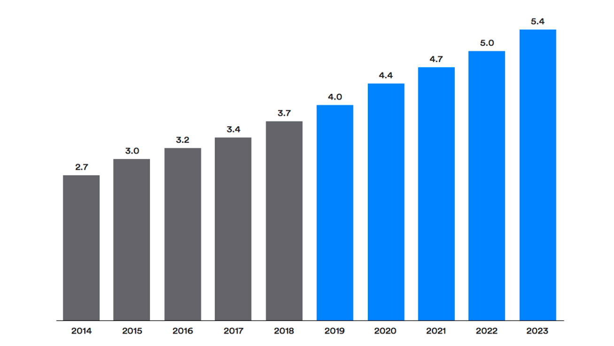
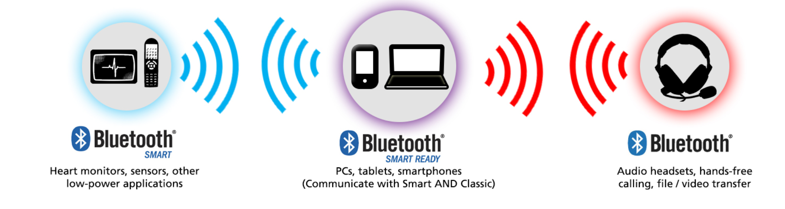
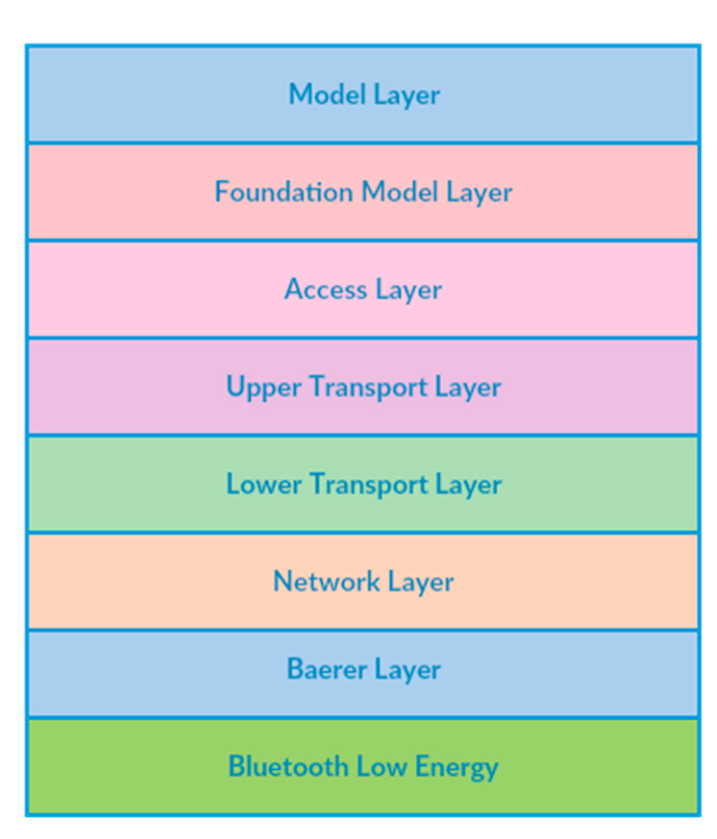
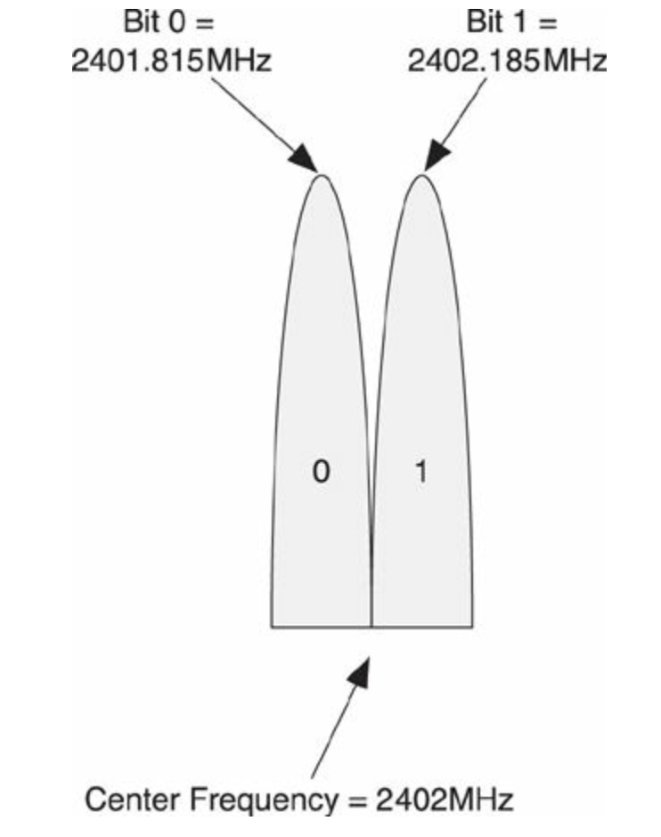
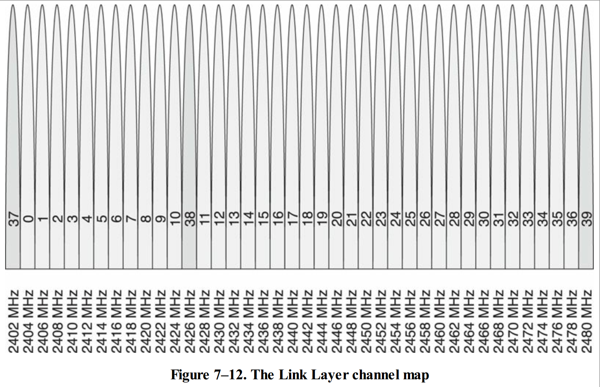
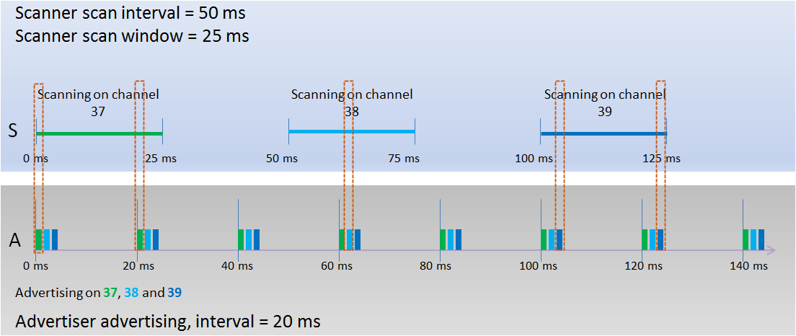
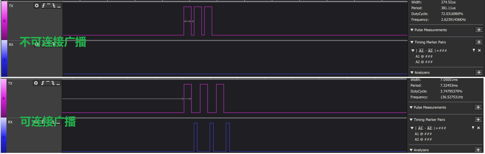

# BLE 协议栈教程

## 历史与发展

​	蓝牙无线技术于1994年被L. M. Ericsson 发明，后面形成一个标准，该标准以丹麦国王Harald Blaatand（“蓝牙”---->国王爱吃蓝莓，牙齿经常被蓝莓染成蓝色）命名。早期由IBM、诺基亚、英特尔、爱立信和东芝在内的主要手机制造商和技术提供商创建了蓝牙兴趣小组（SIG）。这个小组的目的是为无线通信发明一个开放的规范短程通信技术。蓝牙技术仍然由SIG带领下在持续紧跟潮流发展。SIG自成立以来，目前已有1900多家公司加入了SIG。蓝牙自1998年推出以来，蓝牙设备的出货量持续增长，但丝毫没有预期需求会下降。下图显示了近些年来蓝牙年出货量和预测的年度蓝牙设备出货量。

​                                                                   **蓝牙设备年出货量和预期年出货量（单位：10亿）**

### Bluetooth Smart and Bluetooth Smart Ready

市面上的蓝牙产品从体系结构的角度来看可以分为3类：

​	BR/EDR: 传统头戴设备，耳机（目前大部分的TWS耳机都走传统蓝牙协议）用于传输数据量比较大一些的语音文件或者视频。

​	LE:  Bluetooth Low Energy, 通常叫做“Bluetooth Smart” ，是专为低占空比的场景设计的，它的协议规范发表于2010年，手环，摩拜单车锁，心率带等。

​	BR/EDR + LE ： 通常叫做“Bluetooth Smart Ready” ，手机平板等双模蓝牙就属于这种类型。

不同体系结构无法直接通信，即低功耗蓝牙无法和传统蓝牙通信。

Bluetooth Smart是物联网的驱动。Bluetooth Smart小工具可以通过其他支持蓝牙智能的设备获取互联网连接，而不是直接获取互联网连接。这种方法提供了一种更便宜、功耗更低的解决方案。据预测，到2023年，每年将有超过16亿台蓝牙低功耗设备出货，90%的蓝牙设备将采用蓝牙低功耗技术，下图显示了按无线版本划分的蓝牙设备出货量。

## 蓝牙技术分类

#### Bluetooth BR/EDR  （传统蓝牙）

​		传统蓝牙，下图为BR/EDR协议栈的体系结构，本文主要介绍BLE，所以后文将很少有传统蓝牙的介绍。

#### Bluetooth Low Energy 

​		低功耗蓝牙协议栈的体系结构如下：

BLE的体系结构简单很多，协议栈主要分为两层，一层是Host，一层是Control，连接Host和Control的是HCI接口。

#### Bluetooth Mesh 

​	 Mesh 是基于BLE协议之上的一个协议， 拓展了BLE 的能力。早期手机平板等设备，也可以通过代理接入Mesh网络。

## 基础概念

#### 调制

​		低功耗蓝牙采用了高斯频移键控（GFSK）。这里我们先抛开蓝牙的协议，单纯从Radio的角度看收发通信，Radio发送到空中的数据比较简单，要么是0，要么是1，接收端每次也只能在一小段（一个信道）频率上扫描。比方说在2402MHz这个频点上发送数据，发送的频率小于2402MHz负频代表发送0，发送的频率大于2402MHz代表发送1.

​	     

#### 信道

​		

传统蓝牙BR/EDR,有79个窄信道。 而低功耗蓝牙，使用40个无线信道。3个广播信道（初级广播），37个数据信道。Radio每次发送数据只能往一个信道里面发送，大多数芯片的Radio（接收方）每次也只能扫描一个信道的数据。

#### 广播扫描和连接概念的引入

BLE 的广播在没有引入扩展广播之前，是一个比较简单的概念。这里我先介绍用得最普遍的在1M PHY层上的广播。在没有建立连接之前，设备与设备之前只能通过广播发送数据，为了增加发送数据的可靠性，避免频点被一直干扰，所以BLE默认选择每次广播在37，38，39三个信道上遍历发送广播数据。

广播有很多种用途，我先介绍一下最简单的，不可连接的Beacon广播。

有广播，则有扫描，那么BLE 如何扫描的呢。

广播间隔，扫描间隔，扫描窗口。

响应广播数据，可连接广播，定向广播，非定向广播，不可连接广播，扩展广播等会在后续章节中一一描述。

广播只能单方向只发送数据，要快速可靠双向通信，必须要建立连接（当然，你也可以即广播也扫描不建立连接实现双向通信，但这样效率不高）。那么BLE是如何建立连接呢？首先得知道啥时可连接广播。下图为Radio TX 或者RX 活跃时，则拉高对应的IO口, 然后用逻辑分析仪捕获的瞬间图。

由上图可以看到，可连接广播，在Radio层面上每次在一个信道上发送完后，会开一个短暂的RX，如果此时，有其他设备发送连接请求时，则瞬间两者就建立连接了。然后

PHY

GATT

SM

HCI ACI

#### 协议栈学习参考资料

## BLE GATT

## BLE 安全

## BLE 5.0 新特性

