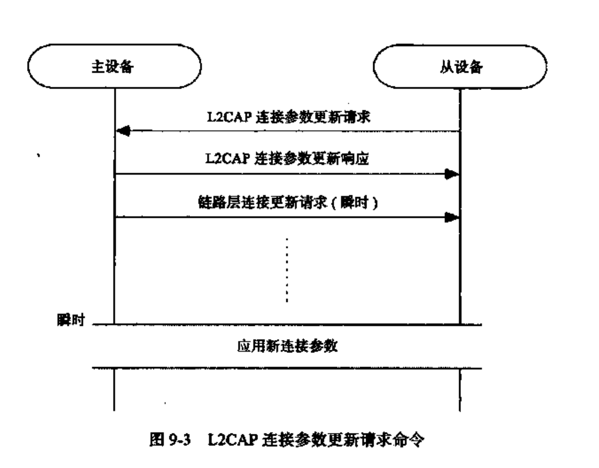
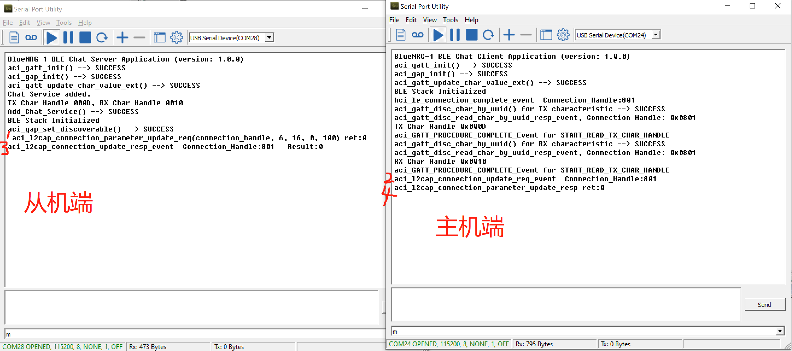
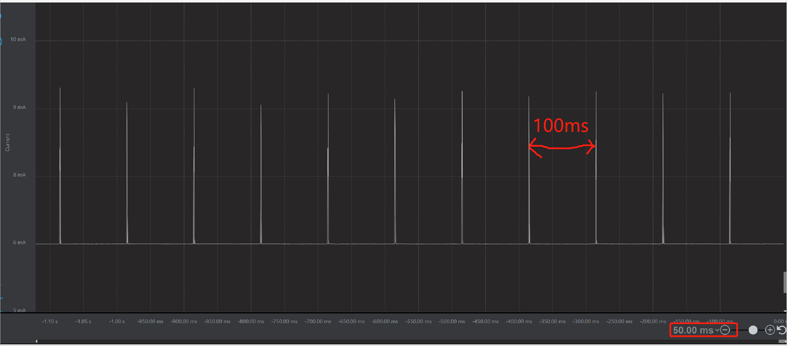

## BlueNRG-x如何更新BLE连接参数	

​    有时为了满足功耗或者通信速率要求，我们需要更新连接参数。“连接参数更新请求”命令可以让从设备更新链路层的连接参数(前提是链路已经建立了连接，并且主机同意更新连接参数)，这些参数包括连接事件间隔（从设备写昂主设备允许从设备发送数据包的频率），从设备延时（从设备能够忽略主设备的连接事件的最大值也称呼为潜伏）以及超时时间。

下面介绍以下连接参数更新的基本流程：



对应在BlueNRG-x中则相关操作的步骤为:

1. 从机发送更新连接参数请求： aci_l2cap_connection_parameter_update_req
2. 主机收到更新请求的事件： aci_l2cap_connection_update_req_event
3. 主机调用API响应从机请求 允许更新： aci_l2cap_connection_parameter_update_resp
4. 从机收到主机的允许更新结果：aci_l2cap_connection_update_resp_event

主要的代码如下（基于基于BlueNRG-1/2 的BLE_Chat工程，BlueNRG-LP 的同样可以用BLE_SerialPort类比）:

### 从机端伪代码

```c
#if SERVER
#define REQUEST_CONN_PARAM_UPDATE  1
struct timer l2cap_req_timer;
#endif

// 从机端： 1.主从在建立连接后， 从机促发更新连接参数请求
void hci_le_connection_complete_event(uint8_t Status,
                                      uint16_t Connection_Handle,
                                      uint8_t Role,
                                      uint8_t Peer_Address_Type,
                                      uint8_t Peer_Address[6],
                                      uint16_t Conn_Interval,
                                      uint16_t Conn_Latency,
                                      uint16_t Supervision_Timeout,
                                      uint8_t Master_Clock_Accuracy)

{ 
  connection_handle = Connection_Handle;
  
  APP_FLAG_SET(CONNECTED);
  
#if REQUEST_CONN_PARAM_UPDATE
  APP_FLAG_CLEAR(L2CAP_PARAM_UPD_SENT);
  Timer_Set(&l2cap_req_timer, CLOCK_SECOND*2);
#endif
}/* end hci_le_connection_complete_event() */

// 上述代码主要做了连接上后，标记需要更新连接参数的标志
```

> 这里增加延时是为了避免更新失败，在主从刚连接上的时候，立马更新连接参数，在某些平台上有导致更新失败，所以得加入一定的延时。延时时间要超过几个连接间隔就好。

从机在void APP_Tick(void)中 加入以下代码

```c
// 
void APP_Tick(void)
{
    ......
#if REQUEST_CONN_PARAM_UPDATE    
  if(APP_FLAG(CONNECTED) && !APP_FLAG(L2CAP_PARAM_UPD_SENT) && Timer_Expired(&l2cap_req_timer))
  {
    uint8_t ret = aci_l2cap_connection_parameter_update_req(connection_handle, 80, 80, 0, 200);
		printf(" aci_l2cap_connection_parameter_update_req(connection_handle, 80, 80, 0, 200) ret:%x \n", ret);
    APP_FLAG_SET(L2CAP_PARAM_UPD_SENT);
  }
#endif
    .....
}
// 这里连接间隔是80*1.25 = 100ms,  超时时间，连接间隔和潜伏的关系建议为: 6*(潜伏+1) <= 超时时间
// 即让空中至少允许有6次丢包的机会。如果环境比较恶劣，需要调大一些超时时间。
// 上述代码APP_Tick()是放在主循环while(1)中不断调用的，从机主要做了识别到需要更新连接标志时，调用更新连接参数的请求函数。
```

从机端定义实现是否更新成功的函数

```c
#if SERVER
void aci_l2cap_connection_update_resp_event(uint16_t Connection_Handle,
                                            uint16_t Result)
{
	printf("%s  Connection_Handle:%x   Result:%x \n", __func__, Connection_Handle, Result);
}
#endif

```


### 主机端

主机端可以是手机或者BlueNRG-x 的主机端。如果BLE从机是和手机连接，只要手机端接受这个连接间隔，一般情况下都会直接允许。

如果主机端是BlueNRG-x ，则示例伪代码如下:

```c
struct connect_param_t{
	uint16_t Connection_Handle;
	uint16_t Conn_Interval_Min;
	uint16_t Conn_Interval_Max;
	uint16_t Slave_latency;
	uint16_t Timeout_Multiplier;
	uint16_t Minimum_CE_Length;
	uint16_t Maximum_CE_Length;
	uint8_t Identifier;
	uint8_t Accept;
};
struct connect_param_t s_con_param;


 /* 这里不要直接在aci_l2cap_connection_update_req_event函数中直接调用aci_l2cap_connection_parameter_update_req， 不然会报错：#define BLE_STATUS_NOT_ALLOWED              ((tBleStatus)(0x46))   因为，aci_l2cap_connection_update_req_event函数没有执行完成，状态不会切换完成，此时调用aci_l2cap_connection_parameter_update_req 会有问题*/
#if CLIENT
void aci_l2cap_connection_update_req_event(uint16_t Connection_Handle,
                                           uint8_t Identifier,
                                           uint16_t L2CAP_Length,
                                           uint16_t Interval_Min,
                                           uint16_t Interval_Max,
                                           uint16_t Slave_Latency,
                                           uint16_t Timeout_Multiplier)
{
	printf("%s  Connection_Handle:%x \n", __func__, Connection_Handle);
	s_con_param.Connection_Handle = Connection_Handle;
	s_con_param.Conn_Interval_Min = Interval_Min;
	s_con_param.Conn_Interval_Max = Interval_Max;
	s_con_param.Slave_latency = Slave_Latency;
	s_con_param.Identifier = Identifier;
	s_con_param.Timeout_Multiplier = Timeout_Multiplier;
	s_con_param.Maximum_CE_Length = 10;
	s_con_param.Minimum_CE_Length = 10;
	s_con_param.Accept = 1;
    // 更新允许更新连接间隔的标志
	APP_FLAG_SET(CLIENT_L2CAP_PARAM_UPD);
}
#endif

// 这里主要将从机发送过来的连接参数给copy一份，然后置同意更新标志，准备调用更新。
```

BlueNRG-x 主机端

```c
void APP_Tick(void)
{
    ......
#if CLIENT
	if (APP_FLAG(CLIENT_L2CAP_PARAM_UPD)){
		aci_l2cap_connection_parameter_update_resp(s_con_param.Connection_Handle, 
s_con_param.Conn_Interval_Min, s_con_param.Conn_Interval_Max, s_con_param.Slave_latency, s_con_param.Timeout_Multiplier, s_con_param.Minimum_CE_Length, s_con_param.Maximum_CE_Length, s_con_param.Identifier,	s_con_param.Accept);
        printf("aci_l2cap_connection_parameter_update_resp ret:%x \n", ret);
		APP_FLAG_CLEAR(CLIENT_L2CAP_PARAM_UPD);
	}
    ......
}
// 触发调用更新函数  APP_Tick是放在while(1)中不断运行的
```


BlueNRG-x 主从建立连接，更新连接参数测试结果验证:

日志端：



功耗端验证连接间隔(这里主要为验证连接间隔，没有让它进入睡眠，功耗调试不是本小节重点，请忽略实际功耗):



上图为从机端的实时电流波形图，可以看到100ms连接间隔更新成功。


再进一步：

​	实际更新连接参数是发生在，收到更新请求后，经过Instant  个连接间隔后才真正更新连接间隔，只是这个Instant  协议栈底层已经处理好了，并没有开放到应用层。