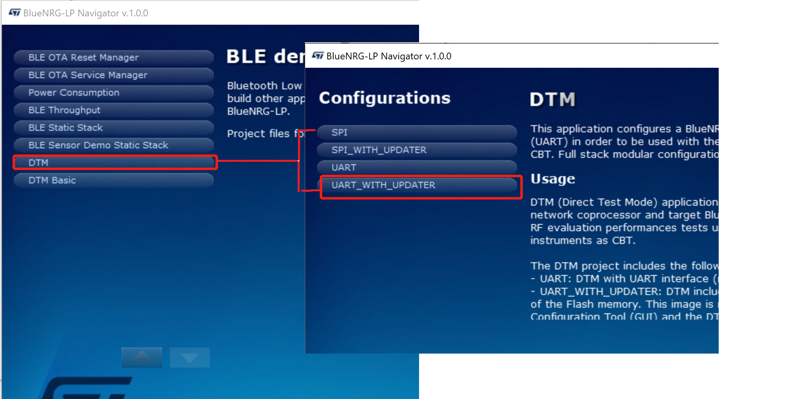
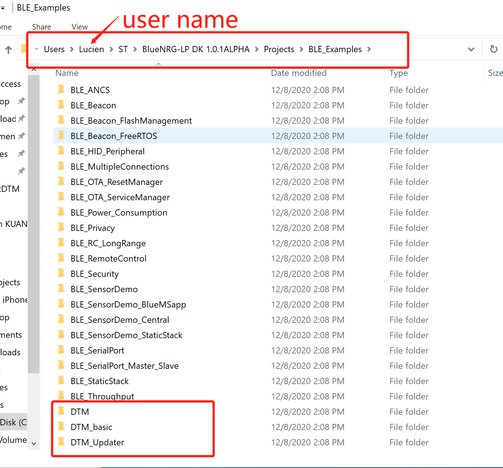
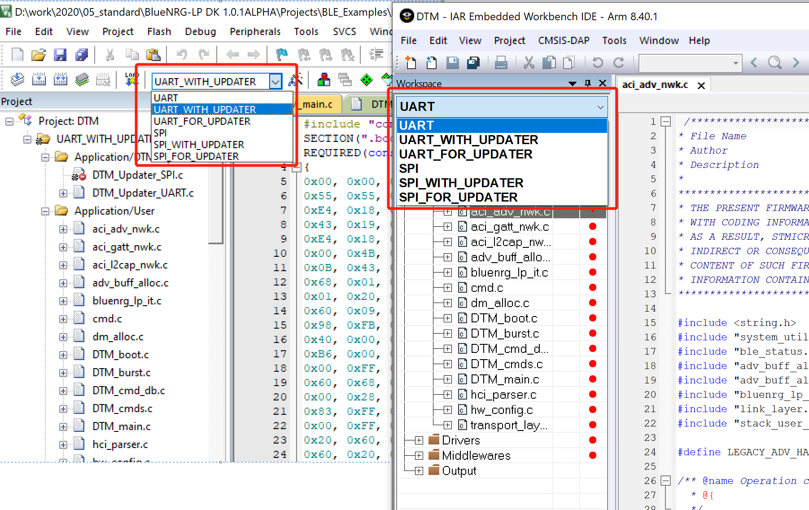

# 关于BlueNRG-LP 的DTM

SDK中提供了比较多的DTM工程和工程里面的不同配置，当使用DTM 工程进行RF测试，或者是作为协处理器，或者是结合GUI进行评估，测试和调试时，容易遇到这么一个问题？ 使用哪个工程中的工程里面的哪个配置。

**太长不看版本：如果不想详细看各个版本的差异，对于普通BlueNRG-355 RF测试或者作为协处理器或者其他用途，建议首选DTM中的UART_WITH_UPDATER。**





如果是BlueNRG-345 或者想深入了解各个版本之间的差异，建议查看下文。

这里我们统一一下描述： 工程指的是一个Example，比方说和DTM有关的的工程有下图3个：





- DTM: 					// DTM是Full Stack
- DTM_basic:         //  DTM 配置为Basic stack
- DTM_Updater:   // 带boot程序DTM  的boot 源码工程

这三个工程中DTM 与DTM_basic是同一类，都是DTM，只是一个是FULL stack（BLE_STACK_FULL_CONF ），一个是配置为basic stack（BLE_STACK_BASIC_CONF ），DTM_Updater只是他们的一个boot程序，支持更新DTM程序。


## DTM 工程：

DTM 工程里面的不同配置有如下图所示：





### DTM 工程包括如下配置:

- UART: DTM 使用UART 接口(不包含升级代码)
- UART_WITH_UPDATER:DTM 使用UART接口,DTM 在Flash的第一页中包含DTM_Updater .并且包含DTM 功能。
- UART_FOR_UPDATER: DTM 使用UART接口,DTM 固件在Flash第一页中留空不填充 (偏移  0x2000). 用户制作升级固件，包含DTM功能。
- SPI: DTM 使用SPI接口(不包含升级代码)
- SPI_WITH_UPDATER: DTM 使用SPI接口,DTM 在Flash的第一页中包含DTM_Updater .并且包含DTM 功能。
- SPI_FOR_UPDATER: DTM 固件在Flash第一页中留空不填充 (偏移  0x2000). 用户制作升级固件。包含DTM功能。

### 

DTM工程逻辑的简明表示

```c
// DTM[UART_WITH_UPDATER] 可以看成是单独的DTM[UART_FOR_UPDATER] 
// 加上boot程序 DTM_Updater[UART]
DTM[UART_WITH_UPDATER]  =  DTM[UART_FOR_UPDATER] + DTM_Updater[UART]
DTM[SPI_WITH_UPDATER]  =  DTM[SPI_FOR_UPDATER] + DTM_Updater[SPI]

// DTM[UART] 可以堪称是DTM[SPI_WITH_UPDATER] 移除boot程序 DTM_Updater[UART]
DTM[UART] = DTM[SPI_WITH_UPDATER] - DTM_Updater[UART]
DTM[SPI] = DTM[SPI_WITH_UPDATER] - DTM_Updater[SPI]
```


