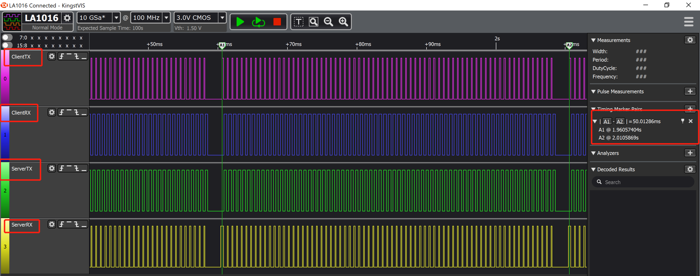

## 如何在Radio TX 或者RX时将某个GPIO置位高电平

  在调试BlueNRG-LP BLE星型网络的多连接节点或者是某些2.4G应用需要查看具体的TX和RX具体时序时，再或者是增加外部PA，有时希望当Radio 发送期间能够用某个GPIO将电平置位高，以方便调试或者使能PA芯片进行TX和RX的转换。


# 增加PA官方参考资料

[AN5574: Driving an external RF front-end with the BlueNRG-LP](https://www.st.com/content/ccc/resource/technical/document/application_note/group1/10/b1/ba/ab/ae/53/49/bc/DM00745431/files/DM00745431.pdf/jcr:content/translations/en.DM00745431.pdf)


## 映射Radio状态在GPIO上

**可以映射的IO信息如下：**

>  TX_SEQUENCE： PA10(AF2), PB15(AF1)

>  TX_SEQUENCE:     PA8(AF2), PA11(AF2)

看到这，可能有人会有疑问，是不是只能用这两两组合进行状态的映射，其实不，这两个是硬件支持的，也可以用软件的方法映射到不同的IO上。

下面我选择TX--->PA10     RX ---> PA11 这个组合进行配，并结合代码进行说明：

1. 初始化对应的IO口为GPIO

```c
static void DEBUG_GPIO_Init(void)
{
  LL_GPIO_InitTypeDef GPIO_InitStruct;
  /* GPIO Ports Clock Enable */
  LL_AHB_EnableClock(LL_AHB_PERIPH_GPIOA);
	  // RF TX PA10 RX PA11
  GPIO_InitStruct.Pin = LL_GPIO_PIN_10 | LL_GPIO_PIN_11;
  GPIO_InitStruct.Mode = LL_GPIO_MODE_ALTERNATE;
  GPIO_InitStruct.Speed = LL_GPIO_SPEED_FREQ_VERY_HIGH;
  GPIO_InitStruct.OutputType = LL_GPIO_OUTPUT_PUSHPULL;
  GPIO_InitStruct.Pull = LL_GPIO_PULL_NO;
  GPIO_InitStruct.Alternate = LL_GPIO_AF_2;
  LL_GPIO_Init(GPIOA, &GPIO_InitStruct);
}
```

2. 使能中断，当TX或者RX时

   ```c
   void enable_BLE_RXTX_SEQ_IRQ(void)
   {
     LL_APB0_EnableClock(LL_APB0_PERIPH_SYSCFG);
     
     LL_SYSCFG_BLERXTX_SetTrigger(LL_SYSCFG_BLERXTX_TRIGGER_BOTH_EDGE, LL_SYSCFG_BLE_TX_EVENT);
     LL_SYSCFG_BLERXTX_SetTrigger(LL_SYSCFG_BLERXTX_TRIGGER_BOTH_EDGE, LL_SYSCFG_BLE_RX_EVENT);
     
     LL_SYSCFG_BLERXTX_SetType(LL_SYSCFG_BLERXTX_DET_TYPE_EDGE, LL_SYSCFG_BLE_TX_EVENT);
     LL_SYSCFG_BLERXTX_SetType(LL_SYSCFG_BLERXTX_DET_TYPE_EDGE, LL_SYSCFG_BLE_RX_EVENT);
     LL_SYSCFG_BLERXTX_EnableIT(LL_SYSCFG_BLE_TX_EVENT|LL_SYSCFG_BLE_RX_EVENT);
     NVIC_EnableIRQ(BLE_SEQ_IRQn);
   }
   ```

   

3. 使能中断，让其可以发生两个边沿中断。

   ```c
   void BLE_RXTX_SEQ_IRQHandler(void)
   {
     if(LL_SYSCFG_BLERXTX_IsInterruptPending(LL_SYSCFG_BLE_TX_EVENT))
     {
       if(RRM->FSM_STATUS_DIG_OUT & RRM_FSM_STATUS_DIG_OUT_STATUS_4)
       {
       // Rising edge
       }
       else
       {
       // Falling edge
       }  
       // Do something
       LL_SYSCFG_BLERXTX_ClearInterrupt(LL_SYSCFG_BLE_TX_EVENT);
     }
     else if(LL_SYSCFG_BLERXTX_IsInterruptPending(LL_SYSCFG_BLE_RX_EVENT))
     {
       if(RRM->FSM_STATUS_DIG_OUT & RRM_FSM_STATUS_DIG_OUT_STATUS_4)
       {
       // Rising edge
       }
       else
       {
       // Falling edge
       }  
       // Do something
       LL_SYSCFG_BLERXTX_ClearInterrupt(LL_SYSCFG_BLE_RX_EVENT);
     }
   }
   ```

   如果要更换IO口，则可以在 注释“Do something”位置处，增加对应的IO操作。


4. 实际测试效果

   使用工程: BlueNRG-LP DK 1.0.1ALPHA\Projects\BLE_Examples\BLE_Throughput\

   将上述代码添加在BLE_Throughput_main.c中，并且在初始化中调用，分别编译Server和Client工程后，分别烧录到两块板子上，并且用逻辑分析仪捕获对应的GPIO。



## 测试结果如下:

### 广播时

当只让slave运行时，只有广播数据，第一个广播为单纯的广播数据没有遇到扫描者，第二个是当有人扫描时的广播波形。


### 连接时

​		连接上后，不更改其他参数，默认是按照23字节的MTU，1M PHY，通信速率大致是220kbps。

