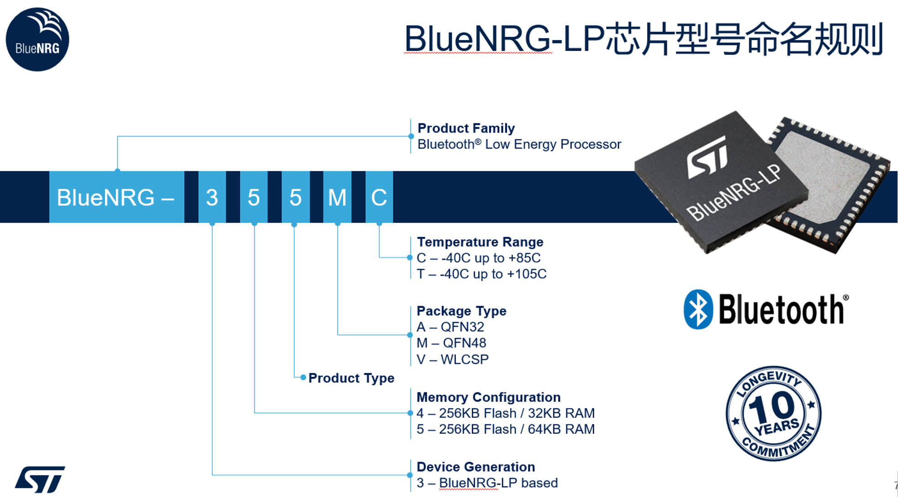
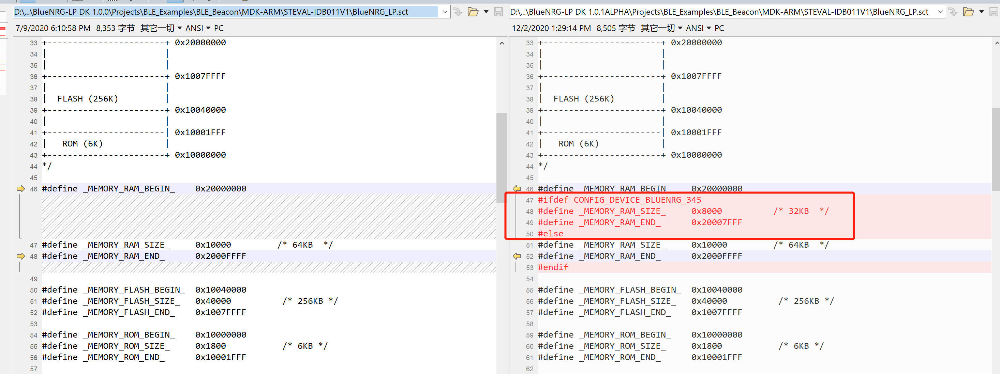
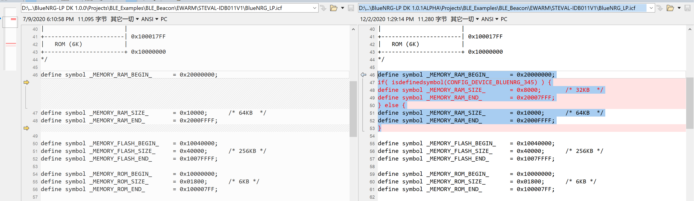
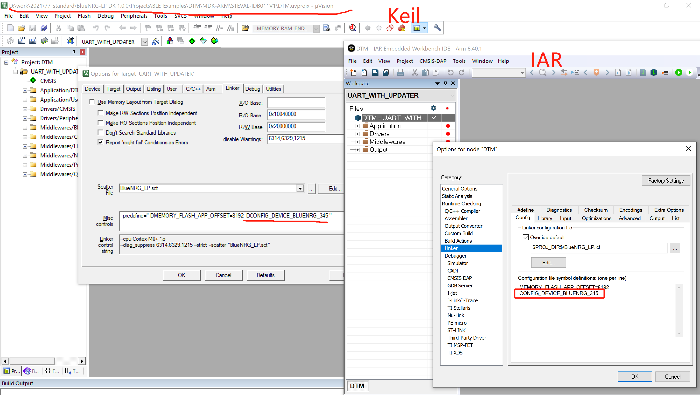
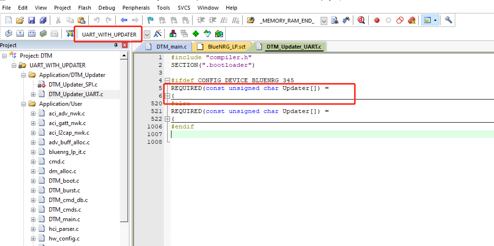

# 使用BlueNRG-345注意事项
当使用BlueNRG-345进行开发的时候，如果使用SDK1.0.0或者阿尔法版本的SDK 1.0.1时，烧录默认工程软件，是无法运行起来的，因为他们的RAM的大小不同，需要做如下配置才能使软件运行起来。




## 适配BlueNRG-345 软件的更改操作（3个步骤）

- 1. 增加BlueNRG-345 链接脚本的控制( SDK 1.0.0 需要此步骤，SDK 1.0.1 跳过此步骤)

  ```c
  // 如果使用的SDK版本为1.0.0，需要更改链接脚本（BlueNRG_LP.icf or BlueNRG_LP.sct）, 如果是阿尔法版本的SDK 1.0.1 则不用更改链接脚本.
  // Keil  BlueNRG_LP.sct 中
  #define _MEMORY_RAM_BEGIN_    0x20000000
  #ifdef CONFIG_DEVICE_BLUENRG_345
  #define _MEMORY_RAM_SIZE_     0x8000          /* 32KB  */
  #define _MEMORY_RAM_END_      0x20007FFF
  #else
  #define _MEMORY_RAM_SIZE_     0x10000         /* 64KB  */
  #define _MEMORY_RAM_END_      0x2000FFFF
  #endif
  
  // IAR  BlueNRG_LP.icf 中
  define symbol _MEMORY_RAM_BEGIN_      = 0x20000000;
  if( isdefinedsymbol(CONFIG_DEVICE_BLUENRG_345) ) {
  define symbol _MEMORY_RAM_SIZE_       = 0x8000;       /* 32KB  */
  define symbol _MEMORY_RAM_END_        = 0x20007FFF;
  } else {
  define symbol _MEMORY_RAM_SIZE_       = 0x10000;      /* 64KB  */
  define symbol _MEMORY_RAM_END_        = 0x2000FFFF;
  }
  ```

- [x] Keil  1.0.0 与1.0.1  链接脚本对比



- [x] IAR 1.0.0 与1.0.1  链接脚本对比



​    在RAM 的末尾处，默认放置的是程序的栈，BlueNRG-345和BlueNRG-355的栈的RAM大小不一致，所以程序的栈的位置也不一样，如果使用BlueNRG-345，而程序的栈没有同步更改过来，则程序无法运行。

- 2. 在linker中和 Preprocessor Symbols中增加宏定义 CONFIG_DEVICE_BLUENRG_345     // 注意Keil 中需要附加-D

- 3. 在Preprocessor中增加定义Symbols CONFIG_DEVICE_BLUENRG_345     // 大部分工程源码中没有用到这个宏，如果不用也可以省略这个步骤

     **linker中定义的宏只能作用与链接脚本文件（如\*.icf， \*.sct）**

     **Preprocessor 中定义的Symbols  只能作用与源代码（如\*.c  \*.h）**

     

## DTM适配为BlueNRG-345 示例

下图举个例子在DTM 工程中的uart_with_updater 配置修改为使用BlueNRG-345，这个工程更改最复杂，又经常使用，所以这里用它来举例子，其他大部分工程只需要简单按照上述步骤操作。

1. 更改链接脚本（BlueNRG_LP.icf or BlueNRG_LP.sct） 和在链接脚本和Linker中增加BlueNRG-345的宏配置CONFIG_DEVICE_BLUENRG_345。



2. 由于BlueNRG-345 DTM 工程中的uart_with_updater  由两段程序组成，一段是boot 代码，所以我们还需要更改DTM_Updater工程中的UART配置的链接脚本（BlueNRG_LP.icf or BlueNRG_LP.sct）和 在Linker中增加BlueNRG-345的宏配置，然后编译生成bin文件
3. 将上一个步骤产生的bin文件生成数组，填充进DTM_Updater_UART.c文件的数组Updater[]中，并使用CONFIG_DEVICE_BLUENRG_345宏配置为不同芯片使用不同的boot程序。



4. 在Preprocessor中增加定义Symbols CONFIG_DEVICE_BLUENRG_345
5. 最后将DTM 工程中UART_WITH_UPDATER配置中的宏更改为： CONFIG_NUM_MAX_LINKS=2   默认是8，默认配置会造成内存不足。所以这里简单将链路数量减小以换取更多的内存。


## 其他

如果你无法区分SDK中的不同DTM工程，可以查看文档  [关于BlueNRG-LP的DTM](AboutDTM/关于BlueNRG-LP的DTM.md)

如果你想直接使用345编译好的DTM固件，请查看 [DTM固件](../Tools/Firmware/DTM/)

