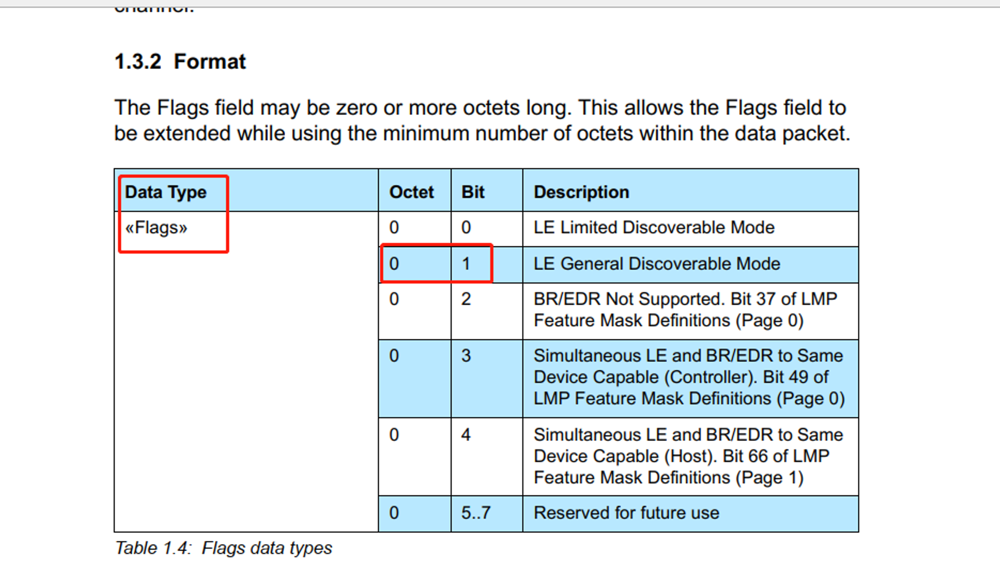

# 如何设定广播数据

好多新使用BLE芯片的客户经常问，怎么广播MAC地址，怎么广播服务UUID等问题。要使用广播数据，首先需要了解基本的BLE广播数据格式。BLE的广播数据和响应广播数据格式如下图，是由一个接一个AD structure组成。

每个AD structure = Length + AD Type + AD Data.

**每个AD type** **和对应AD Data** **的详细内容可以在[Supplement to the Bluetooth Core Specification](../Tools/参考文档/CSS_v9.pdf) (CSS_Vx)中查看。**

下面我们举个例子：要广播一个带16位服务的UUID （FF FE），名字为“111111”， 以及需要将MAC地址为：80：EA:CA:00:00:00 ,广播出来的可连接的广播。

那么数据应该是类似这样。

02 01 06 03 03 FF FE 07 09 31 31 31 31 31 31 09 FF AA AA 80 EA CA 00 00 00 

**数据解析：**

上面的数据可以分成一下几个AD structure：

02 01 06 //02 是长度 01是ad type：Flags. 表明是一个可以连接的BLE广播包，这个对于需要建立连接的应用场合必须要定义这个AD structure

03 03 FF FE // 第一个03是数据长度 第二个03是Complete List of 16-bit Service Class UUIDs

07 09 31 31 31 31 31 31// 07是长度 09是完整的设备名称类型，名称为111111

09 FF AA AA 80 EA CA 00 00 00 // 09 是长度FF是厂商自定义数据类型 ， AA AA 是自定义的公司ID，这两个字节是SIG建议的，如果你硬要不使用公司ID，也可以省略。剩下的值为MAC地址。自定义数据比较灵活，比方说你可以定义一些传感器数据或者其他非标准的。详细AD type 分配的值可以再以下网址查找：

https://www.bluetooth.com/specifications/assigned-numbers/generic-access-profile/

 

- BlueNRG-LP 使用广播的三步骤：
  - ACI_GAP_SET_ADVERTISING_CONFIGURATION			// 配置
  - ACI_GAP_SET_ADVERTISING_DATA                                // 设置广播数据
  - ACI_GAP_SET_ADVERTISING_ENABLE                           // 使能广播
- BlueNRG-1/2 广播的主要API
  - aci_gap_set_discoverable
  - aci_gap_set_non_discoverable
  - aci_gap_set_limited_discoverable
  - aci_gap_update_adv_data
  - hci_le_set_advertising_enable

本文主要描述广播数据格式，如果你想了解广播的更多知识，请查看

