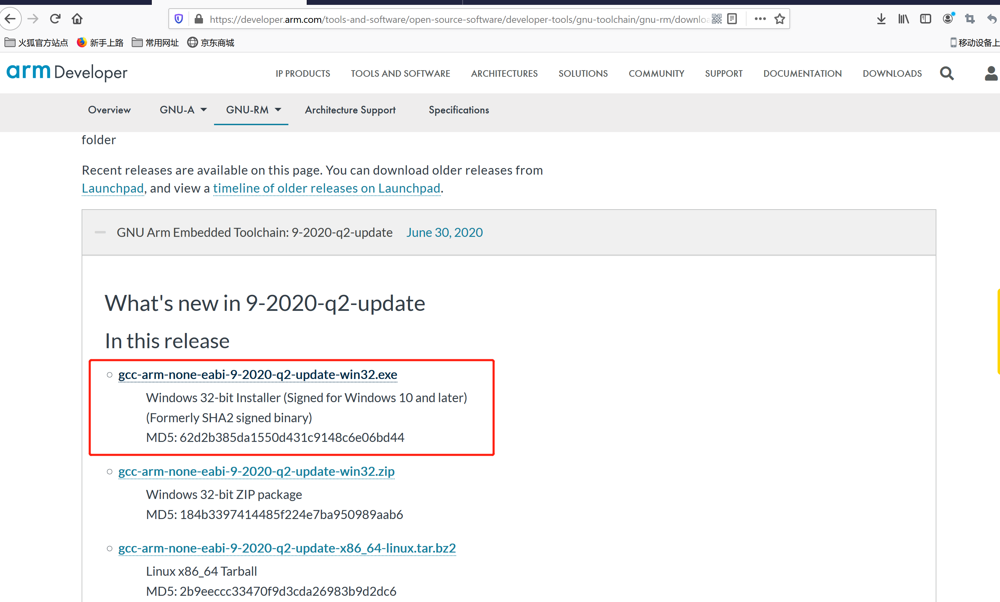

# 如何安装GNU工具链

## 1. 下载和安装工具链

> 百度或者Google "gnu arm none eabi", 也可以直接选择下面的链接去下载。 

https://developer.arm.com/tools-and-software/open-source-software/developer-tools/gnu-toolchain/gnu-rm/downloads

<!--  -->

> 下载好后安装好把安装目录记录下，待会需要用到。

>  我的是直接在C盘下： C:\Program Files (x86)\GNU Tools ARM Embedded\8 2018-q4-major\bin

# 设置环境变量

> 右击我的电脑（This pc）-->属性(Properties)-->高级系统设置(Advanced system settings)-->环境变量--->系统环境变量（System Variables）中增加到path中。

# 测试是否正确安装

> 打开window命令行任意一个路径，然后输入以下命令“arm-none-eabi-gcc  --version ”, 然后可以看到有版本信息输出，说明整个安装设置过程正确。

