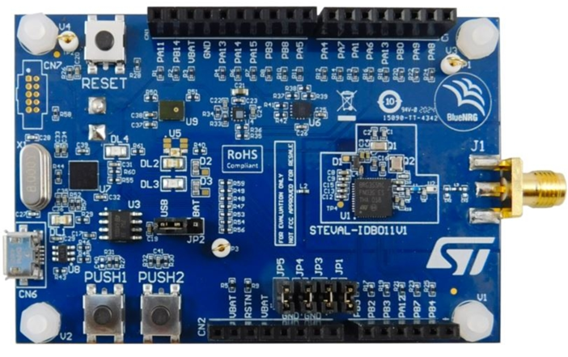

# 认识BlueNRG-LP的评估板

在首次拿到BlueNRG系列的评估板时，评估板子里面很可能默认的是**Sensor Demo（带睡眠）**，调试下载需要按住PUSH1（boot引脚）然后按一下复位按键并松开，然后再松开PUSH1.这样芯片就可以脱离睡眠模式，然后停留在boot阶段，可以进行下载调试。

目前BlueNRG-LP系列主要发布一款评估板。

- STEVAL-IDB011V1

​	开发板自带CMSIS-DAP调试器，此调试起也自带USB转串口功能。JP2可以切换电源为USB供电或者电池供电

JP3,JP4,JP5为调试口跳帽，需要注意的是，当使用其他调试器连接开发板上的SW口时，是远离BlueNRG-LP芯片的那侧（挨着排母的那侧），才是和芯片直接相连接的，跳线时需要注意此点。

JP1 可用于测量流经BlueNRG-LP芯片的电流。

​	

- STEVAL-IDB011V2   // 尚未发布，敬请期待

- STEVAL-IDB012V1   // 尚未发布，敬请期待

  

## 评估板子官方参考资料

**[STEVAL-IDB011V1](https://www.st.com/content/st_com/en/products/evaluation-tools/solution-evaluation-tools/communication-and-connectivity-solution-eval-boards/steval-idb011v1.html)**

