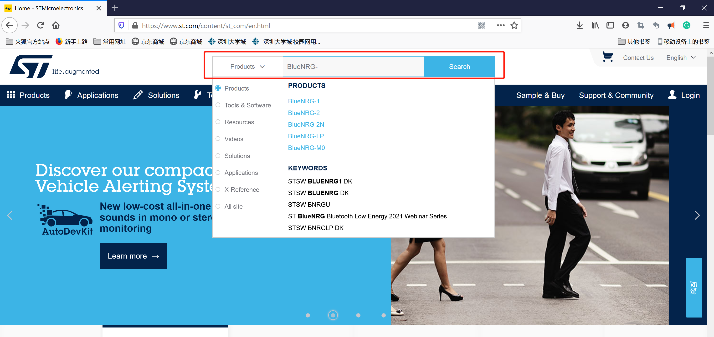
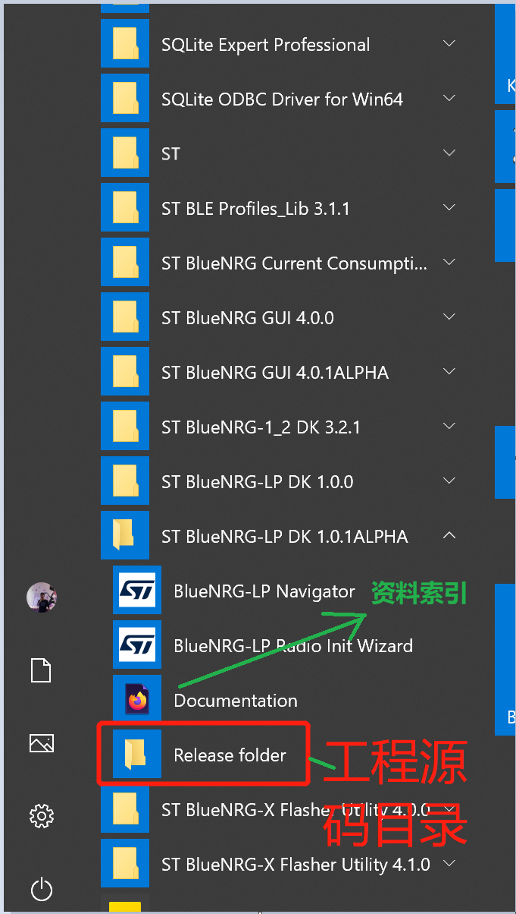

# 下载资料与软件安装
在www.st.com 的搜索框中搜索 “BlueNRG-1”   “BlueNRG-2”  “BlueNRG-LP”
就可以找到对应的资料主页。

[BlueNRG-LP资料主页](https://www.st.com/content/st_com/en/products/wireless-connectivity/short-range/bluetooth-low-energy-application-processors/bluenrg-lp.html)

[BlueNRG-2资料主页](https://www.st.com/content/st_com/en/products/wireless-transceivers-mcus-and-modules/bluetooth-bluetooth-low-energy/bluenrg-2.html )

对于BlueNRG-1, **BlueNRG-2N**(协处理器)， 的资料可以参考BlueNRG-2的资料。其他老产品BlueNRG-MS，搜索资料也是类似

## BlueNRG-LP 开发需要下载的安装的软件或工具

进行BlueNRG-LP的开发一般需要下载如下软件，如下ST提供的工具软件部分都可以通过芯片主页的**Tools & software**栏进行跳转。当前暂时只支持window操作系统开发，没有支持Linux 操作系统和MAC OS。

#### 第三方编译工具：

- ​	Keil  或者 IAR			                     // 需要选择至少一个工具
-    Git                                                   // 建议安装
- Source insight   或者vscode          // 建议安装一个

#### ST提供的建议下载安装的软件或工具:

•**[STSW-BNRGLP-DK](https://www.st.com/content/st_com/en/products/embedded-software/evaluation-tool-software/stsw-bnrglp-dk.html)** 							**//** SDK  源码

•**[STSW-BNRG001](https://www.st.com/content/st_com/en/products/embedded-software/wireless-connectivity-software/stsw-bnrg001.html)** 								**//** BlueNRG 功耗评估工具

•**[STSW-BNRGFLASHER](https://www.st.com/content/st_com/en/products/embedded-software/wireless-connectivity-software/stsw-bnrgflasher.html)** 					 **//** **下载工具**

•**[STSW-BNRGUI](https://www.st.com/content/st_com/en/products/embedded-software/wireless-connectivity-software/stsw-bnrgui.html)** 								 **// RF 测试 协议栈学习或者评估工具**

#### ST提供的可选下载安装的软件或工具:

•**[STSW-BNRGLP-Mesh](https://www.st.com/content/st_com/en/products/embedded-software/wireless-connectivity-software/stsw-bnrglp-mesh.html)**  					 **//** **可选安装，Mesh SDK**

## BlueNRG-1/2 开发需要下载的安装的软件或工具

#### 第三方编译工具：

- ​	Keil  或者 IAR			                     // 需要选择至少一个工具
-    Git                                                   // 建议安装
- Source insight   或者vscode          // 建议安装一个

#### ST提供的建议下载安装的软件或工具:

•**[STSW-BLUENRG1-DK](https://www.st.com/content/st_com/en/products/embedded-software/evaluation-tool-software/stsw-bluenrg1-dk.html)** 					   // SDK  源码

•**[STSW-BNRG001](https://www.st.com/content/st_com/en/products/embedded-software/wireless-connectivity-software/stsw-bnrg001.html)** 								**//** BlueNRG 系列功耗评估工具

•**[STSW-BNRGFLASHER](https://www.st.com/content/st_com/en/products/embedded-software/wireless-connectivity-software/stsw-bnrgflasher.html)** 					 **//** BlueNRG  系列**下载工具**

•**[STSW-BNRGUI](https://www.st.com/content/st_com/en/products/embedded-software/wireless-connectivity-software/stsw-bnrgui.html)** 								 **// BlueNRG  系列 RF 测试 协议栈学习或者评估工具**

#### ST提供的可选下载安装的软件或工具:	

**[STSW-BNRG-Mesh](https://www.st.com/content/st_com/en/products/embedded-software/wireless-connectivity-software/stsw-bnrg-mesh.html)                           // 可选安装，Mesh SDK**

## 开发环境搭建

​	所有软件建议安装默认路径，安装好SDK 后，如下图所示，可以通过引导打开资料索引和工程源码目录。

#### BlueNRG-x资料索引和工程源码目录:

- BlueNRG-LP资料索引:

  - C:\Users\${user name}\ST\BlueNRG-LP DK x.x.x\Docs\index.html

- BlueNRG-1/2资料索引:

  - C:\Program Files (x86)\STMicroelectronics\BlueNRG-1_2 DK 3.2.1\Docs\index.html

- BlueNRG-x 工程源码目录：

  - C:\Users\${user name}\ST\ "BlueNRG-LP DK x.x.x" or "BlueNRG-1_2 DK x.x.x"

  

